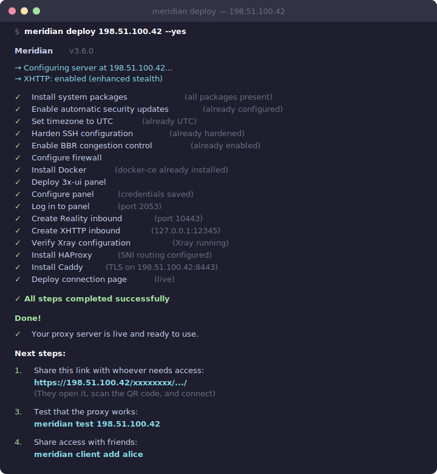
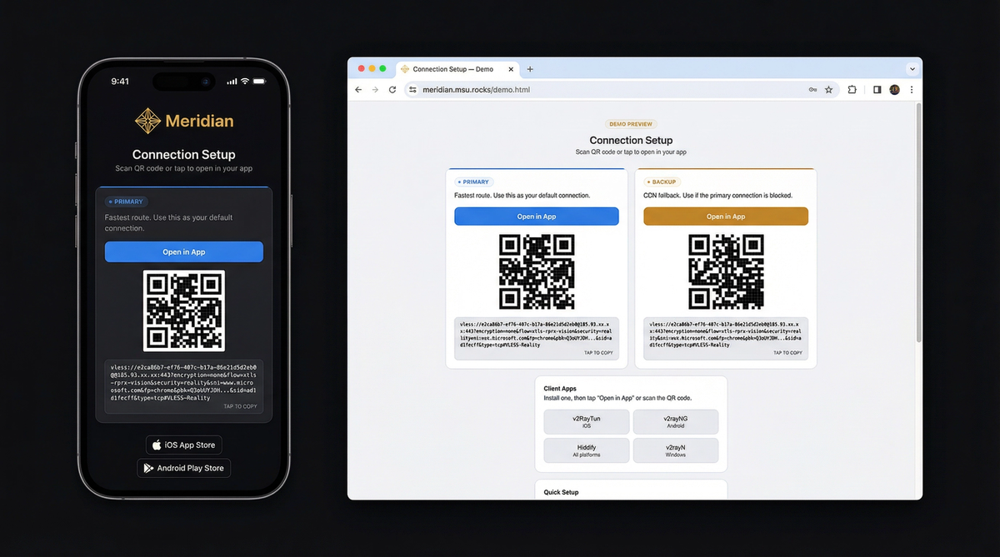
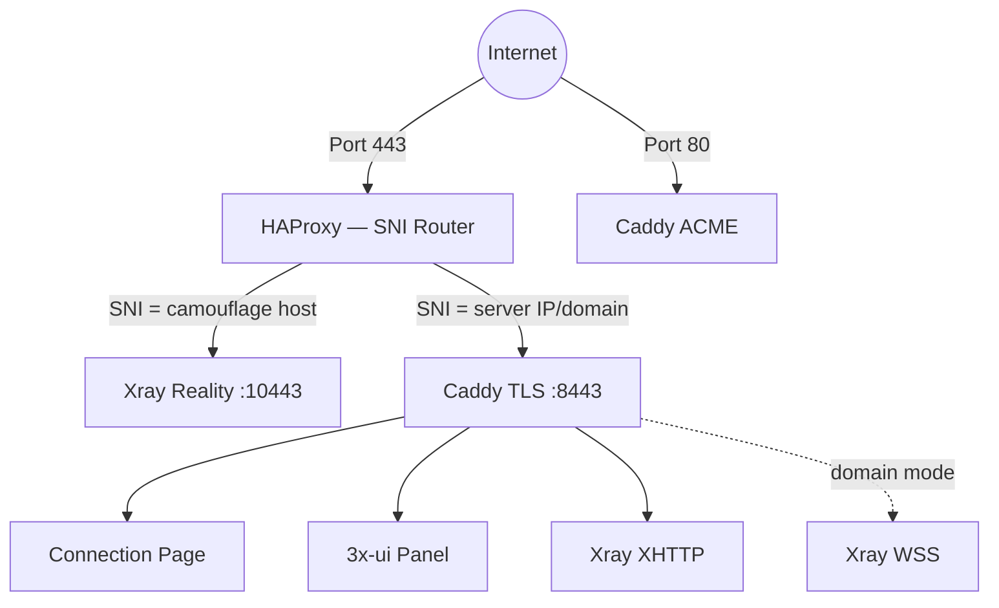

<p align="center">
  
</p>

<h1 align="center">Meridian</h1>

<p align="center">
  <a href="https://github.com/uburuntu/meridian/actions/workflows/ci.yml"></a>
  <a href="https://pypi.org/project/meridian-vpn/"></a>
  <a href="LICENSE"></a>
  <a href="https://github.com/uburuntu/meridian/stargazers"></a>
</p>

<p align="center">Deploy a censorship-resistant proxy server in one command.<br>Invisible to DPI, active probing, and TLS fingerprinting.</p>

<p align="center">
  
</p>

## What is this

Meridian deploys a private, undetectable VPN server in minutes. Share secure internet access with family and friends — they scan a QR code and connect. When your IP gets blocked, spin up a new server and be back online in minutes. No technical knowledge required on the client side.

Whether you're the "tech friend" setting up VPN for people you care about, a power user managing multiple servers, or an NGO providing access in a censored region — Meridian handles the complexity so you can focus on staying connected.

See [SECURITY.md](SECURITY.md) for the threat model and what Meridian protects against (and what it doesn't).

## Install

Works on **macOS and Linux**. Windows users: use WSL.

```bash
curl -sSf https://getmeridian.org/install.sh | bash
```

Or install directly from PyPI:

```bash
uv tool install meridian-vpn    # recommended
pipx install meridian-vpn       # alternative
```

## Quick start

```bash
meridian deploy                       # interactive wizard
meridian deploy 1.2.3.4               # deploy to server
meridian deploy local                 # deploy on this server (no SSH needed)
meridian deploy 1.2.3.4 --domain d.io # with CDN fallback
```

After setup, your server is a fully functional proxy. Share access:

```bash
meridian client add alice            # generate keys for a friend
meridian client list                 # see all clients
meridian client remove alice         # revoke access
```

Each client gets a connection page hosted on the server with QR codes, one-tap deep links, and [live usage stats](https://getmeridian.org/demo). Share the URL directly — no file transfer needed.

<p align="center">
  
</p>

## How it works

Meridian deploys [VLESS+Reality](https://github.com/XTLS/Xray-core) — a protocol that makes your server indistinguishable from a legitimate website:

| Censorship method | How Meridian beats it |
|---|---|
| **Deep Packet Inspection** | Traffic is byte-for-byte identical to normal HTTPS. No proxy signatures. |
| **Active probing** | Censors connecting to your server get a real TLS certificate from microsoft.com. Only clients with your private key reach the proxy. |
| **TLS fingerprinting** | uTLS impersonates Chrome's exact Client Hello, matching billions of real devices. |
| **IP blocking** | Domain mode routes through Cloudflare CDN as a fallback — no direct IP exposure. |

## What you need

- A VPS (Debian/Ubuntu) with root SSH key access — $3–5/month from any provider
- Recommended: Finland, Netherlands, Sweden, Germany (low latency, not flagged)
- Optional: a domain pointed to the server (for CDN fallback via Cloudflare)

## Commands

| Command | Description |
|---------|-------------|
| `meridian deploy [IP\|local]` | Deploy proxy server (interactive wizard if no IP) |
| `meridian client add NAME` | Add a named client key |
| `meridian client list` | List all clients |
| `meridian client remove NAME` | Remove a client key |
| `meridian server list` | List managed servers |
| `meridian server add IP` | Add an existing server (fetches credentials via SSH) |
| `meridian server remove NAME` | Remove a server from the registry |
| `meridian relay deploy RELAY_IP` | Deploy a relay node (TCP forwarder) |
| `meridian relay list` | List relay nodes |
| `meridian relay remove RELAY_IP` | Remove a relay node |
| `meridian relay check RELAY_IP` | Check relay health |
| `meridian preflight [IP]` | Pre-flight validation (ports, SNI, ASN, DNS) |
| `meridian scan [IP]` | Find optimal SNI targets on server's network |
| `meridian test [IP]` | Test proxy reachability from this device |
| `meridian doctor [IP]` | Collect info for bug reports (alias: `rage`) |
| `meridian teardown [IP]` | Remove proxy from server |
| `meridian update` | Update CLI |
| `meridian --version` | Show installed version |

**Setup flags**: `--domain DOMAIN`, `--sni HOST`, `--no-xhttp` (XHTTP enabled by default), `--email EMAIL`, `--name NAME`, `--user USER`, `--yes`

**Global flag**: `--server NAME` — target a specific named server (works with most commands)

## Architecture



**Standalone mode** — HAProxy on port 443 routes Reality traffic to Xray. Caddy provides auto-TLS (Let's Encrypt IP certificate) for hosted connection pages, panel access, and XHTTP transport. No domain needed.

**Domain mode** — Same architecture, plus Caddy handles VLESS+WSS through Cloudflare CDN as a fallback when the server IP is blocked.

**Relay mode** — A lightweight TCP forwarder (Realm) on a domestic server forwards port 443 to the exit server abroad. All protocols work through the relay with end-to-end encryption.

## Client apps

After setup, connect with any of these apps:

| Platform | App |
|----------|-----|
| iOS | [v2RayTun](https://apps.apple.com/app/v2raytun/id6476628951) |
| Android | [v2rayNG](https://github.com/2dust/v2rayNG/releases/latest) |
| Windows | [v2rayN](https://github.com/2dust/v2rayN/releases/latest) |
| All platforms | [Hiddify](https://github.com/hiddify/hiddify-app/releases/latest) |

## Common scenarios

**My IP got blocked** — The most common scenario in censored regions. Get a new VPS, run `meridian deploy NEW_IP`, then re-add clients with `meridian client add`. If you're in domain mode, update the DNS A record to point at the new IP and re-run deploy. If you're not using domain mode yet, consider switching (`--domain`) to get a CDN fallback through Cloudflare — when the IP is blocked, the WSS/CDN link still works.

**Sharing with family** — After `meridian client add alice`, you get a shareable URL hosted on the server. Send the link by email, iMessage, or any messenger. They open it on their phone, install the app (one tap), scan the QR code, and connect. No file transfer needed.

**First-time VPS setup** — Rent a VPS from any provider (DigitalOcean, Hetzner, Vultr — $4–6/month). Choose Debian 12 or Ubuntu 22.04+. Make sure you have SSH key access (not just password). Then run `meridian deploy YOUR_SERVER_IP`.

## Troubleshooting

Not connecting? Run `meridian test` to check if the server is reachable, or use the [web-based ping tool](https://getmeridian.org/ping).

Something else not working? Get instant AI-powered help:

```bash
meridian doctor --ai        # copies an AI-ready prompt to clipboard
```

Paste the prompt into ChatGPT, Claude, or any AI assistant for personalized troubleshooting.

Or [open an issue](https://github.com/uburuntu/meridian/issues) with `meridian doctor` output.

## Docs

Full documentation, interactive command builder, and setup guides:

**[getmeridian.org](https://getmeridian.org)** · [Connection page demo](https://getmeridian.org/demo)
