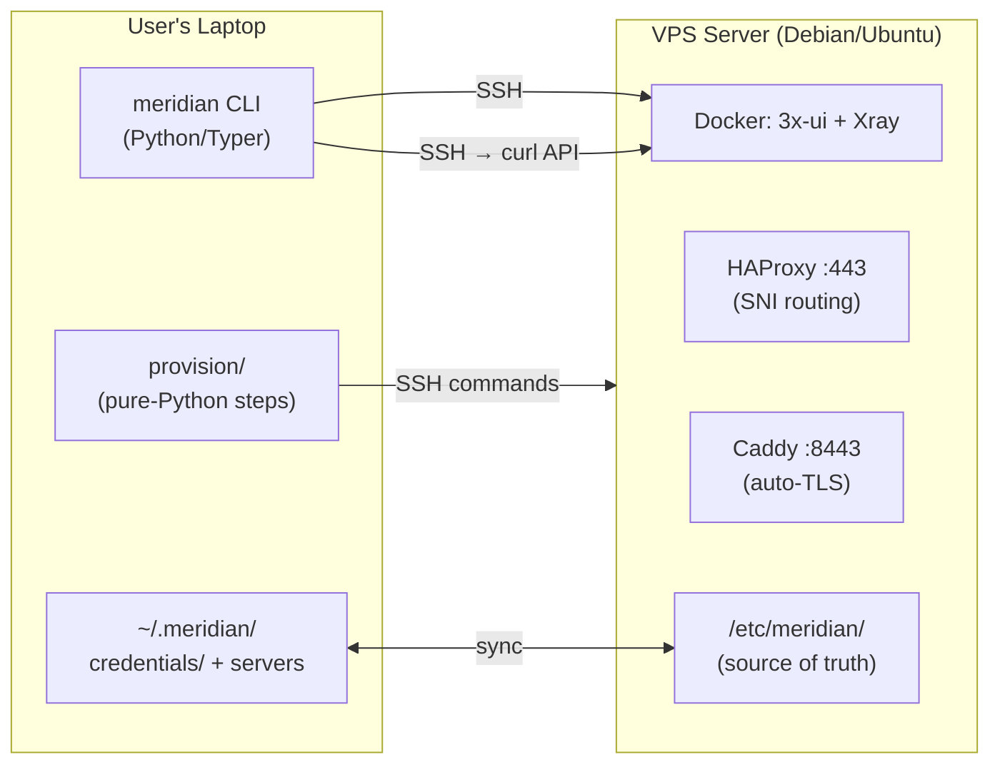
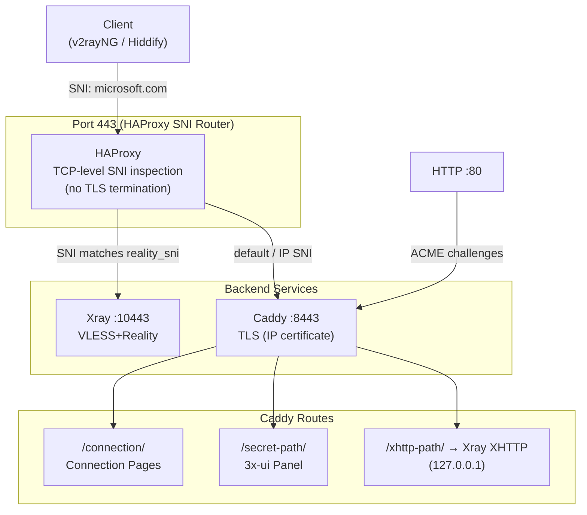
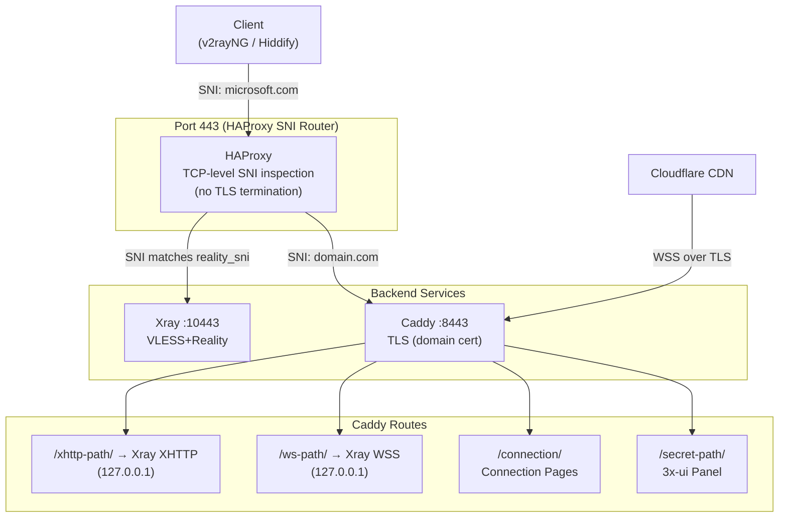
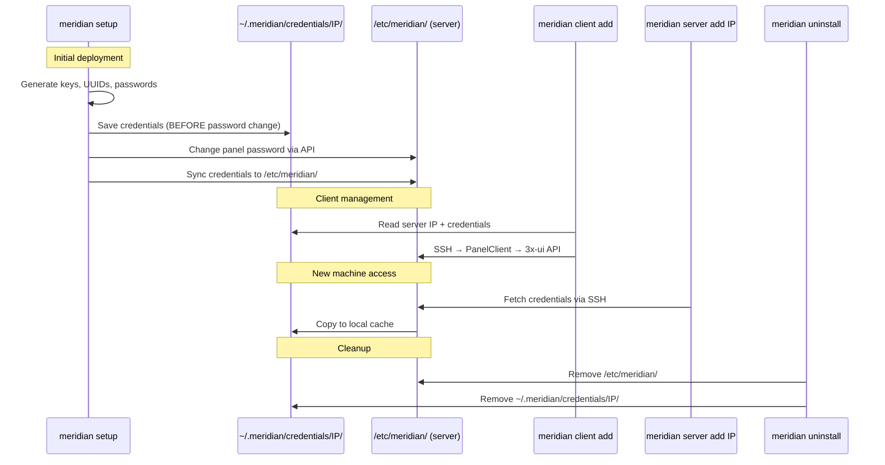
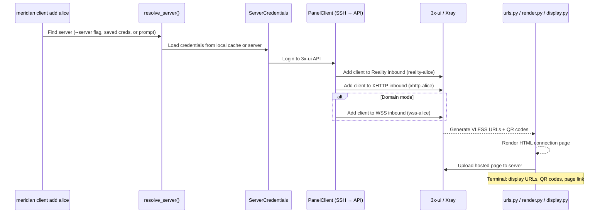
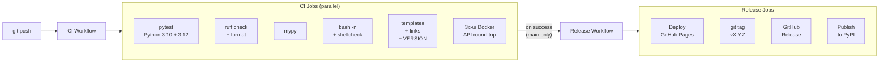
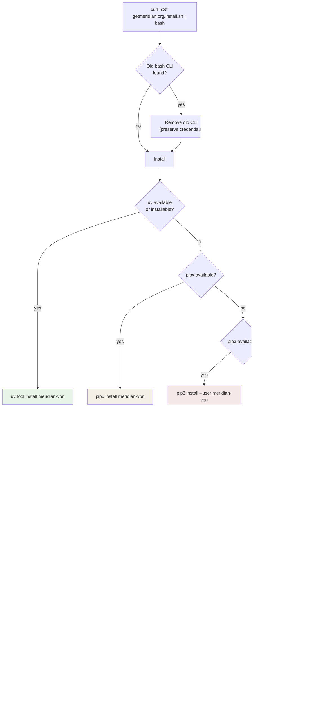

# Architecture

Meridian is a CLI tool that deploys censorship-resistant VLESS+Reality proxy servers. It connects to a VPS via SSH using a pure-Python provisioner, configures Docker/Xray/HAProxy/Caddy, and manages clients through the 3x-ui panel API. Designed for semi-technical users who share VPN access with less technical people.

## Component overview



## Traffic flow: Standalone mode

In standalone mode (no domain), HAProxy on port 443 routes by SNI. Xray handles Reality connections, Caddy handles everything else with a Let's Encrypt IP certificate (ACME `shortlived` profile, 6-day validity). Caddy listens on port 80 for ACME HTTP-01 challenges. XHTTP is reverse-proxied by Caddy via path-based routing — no extra external port.



## Traffic flow: Domain mode

Domain mode adds VLESS+WSS (Cloudflare CDN fallback) and uses a real domain for TLS. HAProxy still sits on port 443 for SNI routing. Caddy terminates TLS for the domain and reverse-proxies both XHTTP and WSS to Xray.



## Provisioner step pipeline

`meridian setup` uses a pure-Python provisioner (no Ansible). The `build_setup_steps()` function in `provision/__init__.py` assembles the pipeline based on context flags.

The exact step order (from `provision/__init__.py`):

```mermaid
graph TD
    Start["meridian setup"] --> Context["Create ProvisionContext<br/>+ ServerConnection"]
    Context --> Build["build_setup_steps(ctx)"]
    Build --> Provisioner["Provisioner.run()"]

    Provisioner --> P1["1. Install system packages<br/><i>InstallPackages</i>"]
    P1 --> P2["2. Enable automatic security updates<br/><i>EnableAutoUpgrades</i>"]
    P2 --> P3["3. Set timezone to UTC<br/><i>SetTimezone</i>"]
    P3 --> P4["4. Harden SSH configuration<br/><i>HardenSSH</i>"]
    P4 --> P5["5. Enable BBR congestion control<br/><i>ConfigureBBR</i>"]
    P5 --> P6["6. Configure firewall<br/><i>ConfigureFirewall</i>"]

    P6 --> D1["7. Install Docker<br/><i>InstallDocker</i>"]
    D1 --> D2["8. Deploy 3x-ui container<br/><i>Deploy3xui</i>"]

    D2 --> X1["9. Configure panel credentials<br/><i>ConfigurePanel</i>"]
    X1 --> X2["10. Login to panel API<br/><i>LoginToPanel</i>"]
    X2 --> X3["11. Create Reality inbound<br/><i>CreateRealityInbound</i>"]

    X3 --> XHTTP{"XHTTP<br/>enabled?"}
    XHTTP -->|yes| X4["12. Create XHTTP inbound<br/><i>CreateXHTTPInbound</i>"]
    XHTTP -->|no| Domain

    X4 --> Domain{"Domain<br/>mode?"}
    Domain -->|yes| X5["13. Create WSS inbound<br/><i>CreateWSSInbound</i>"]
    Domain -->|no| X6

    X5 --> X6["14. Verify Xray inbounds<br/><i>VerifyXray</i>"]

    X6 --> Web{"needs_web_server?<br/>(domain OR hosted page)"}
    Web -->|yes| S1["15. Install HAProxy<br/><i>InstallHAProxy</i>"]
    Web -->|no| Done["Done"]

    S1 --> S2["16. Install Caddy<br/><i>InstallCaddy</i>"]
    S2 --> S3["17. Deploy connection page<br/><i>DeployConnectionPage</i>"]
    S3 --> Done

    style P1 fill:#e8f4e8
    style P2 fill:#e8f4e8
    style P3 fill:#e8f4e8
    style P4 fill:#e8f4e8
    style P5 fill:#e8f4e8
    style P6 fill:#e8f4e8
    style D1 fill:#e8e4f4
    style D2 fill:#e8e4f4
    style X1 fill:#f4e8e8
    style X2 fill:#f4e8e8
    style X3 fill:#f4e8e8
    style X4 fill:#f4e8e8
    style X5 fill:#f4e8e8
    style X6 fill:#f4e8e8
    style S1 fill:#e8e8f4
    style S2 fill:#e8e8f4
    style S3 fill:#e8e8f4
```



**Legend:** Green = OS hardening, Purple = Docker, Red = Panel/Xray, Blue = Services.

The `needs_web_server` flag is true when either `domain_mode` (domain was provided) or `hosted_page` (serve connection pages on the server) is enabled. In standalone mode without hosted pages, the pipeline ends after VerifyXray.

### Key abstractions

| Abstraction | File | Purpose |
|-------------|------|---------|
| `Step` | `provision/steps.py` | Protocol: `run(conn, ctx) -> StepResult` |
| `StepResult` | `provision/steps.py` | Status (`ok`/`changed`/`skipped`/`failed`) + detail + duration |
| `ProvisionContext` | `provision/steps.py` | Typed config (IP, domain, SNI, flags) + inter-step state via `__getitem__`/`__setitem__` |
| `Provisioner` | `provision/steps.py` | Runs steps sequentially with Rich spinner output, stops on failure |
| `ServerConnection` | `ssh.py` | SSH command execution wrapper with `local_mode` and `needs_sudo` support |
| `PanelClient` | `panel.py` | 3x-ui REST API via SSH curl (login, inbounds, clients, settings) |

### Step modules

| Module | Steps | What they do |
|--------|-------|-------------|
| `provision/common.py` | `InstallPackages`, `EnableAutoUpgrades`, `SetTimezone`, `HardenSSH`, `ConfigureBBR`, `ConfigureFirewall` | OS-level setup: packages, security updates, UTC, SSH key-only, BBR, UFW |
| `provision/docker.py` | `InstallDocker`, `Deploy3xui` | Docker engine + 3x-ui container (pinned version) |
| `provision/panel.py` | `ConfigurePanel`, `LoginToPanel` | Generate/load credentials, configure panel settings, API login |
| `provision/xray.py` | `CreateRealityInbound`, `CreateXHTTPInbound`, `CreateWSSInbound`, `VerifyXray` | VLESS inbound creation via 3x-ui REST API, connectivity verification |
| `provision/services.py` | `InstallHAProxy`, `InstallCaddy`, `DeployConnectionPage` | SNI router, TLS termination + web serving, hosted HTML pages with QR codes and stats |
| `provision/uninstall.py` | Uninstall steps | Clean removal of all components + credential cleanup |

## Credential lifecycle

Credentials are saved locally BEFORE changing the panel password to prevent lockout on failure. The server is the source of truth; the local cache enables cross-machine access.



## Client management flow

Clients are managed via the 3x-ui REST API through SSH. Each client gets entries across all active inbound types (Reality, XHTTP, WSS) using the naming convention `{protocol}-{name}` (e.g., `reality-alice`, `xhttp-alice`, `wss-alice`).



## CI/CD pipeline

Two workflows run in sequence: CI validates on every push/PR, then Release deploys on CI success (main branch only).



**Pipeline chain:** `git push` -> CI (validates) -> Release (deploys, tags, publishes).

**Pages build:** The Release workflow builds `_site/` by copying `docs/` + `install.sh` + `setup.sh` + `VERSION` (as `version`) + `SHA256SUMS` + `ai/reference.md`. Deployed via `actions/deploy-pages` artifact (no git commits for synced files).

## Install and PATH flow

The installer (`install.sh`) handles tool detection, installation, PATH configuration, and symlink creation for `sudo` access.



**Key detail:** On Debian/Ubuntu, `.bashrc` has `case $- in *i*) ;; *) return;; esac` near the top. Anything appended AFTER this guard is unreachable for non-interactive shells (`ssh host 'cmd'`). The installer PREPENDS the PATH export before the guard using `mktemp` + `cat` + `mv`. Idempotency uses a `# Meridian CLI` marker.

## Key files to read first

| File | Purpose |
|------|---------|
| `src/meridian/cli.py` | Entry point, all subcommands registered here |
| `src/meridian/commands/setup.py` | Interactive wizard + provisioner execution |
| `src/meridian/provision/__init__.py` | `build_setup_steps()` -- assembles the step pipeline |
| `src/meridian/provision/steps.py` | Core abstractions: `Step`, `StepResult`, `ProvisionContext`, `Provisioner` |
| `src/meridian/credentials.py` | `ServerCredentials` dataclass (YAML load/save, v1->v2 migration) |
| `src/meridian/ssh.py` | SSH connection, local mode detection, `tcp_connect` |
| `src/meridian/panel.py` | `PanelClient`: 3x-ui REST API wrapper via SSH curl |
| `src/meridian/protocols.py` | Protocol ABC + `InboundType` registry + concrete implementations |
| `src/meridian/urls.py` | VLESS URL building and QR code generation |
| `src/meridian/render.py` | HTML/text file rendering (connection pages) |
| `src/meridian/display.py` | Terminal output for connection info |
| `tests/test_cli.py` | CLI smoke tests (good for understanding available commands) |

## What happens during `meridian setup`

1. CLI resolves server IP (argument, saved server, or interactive prompt)
2. CLI checks SSH connectivity, detects if running on the server itself (`detect_local_mode`)
3. Interactive wizard prompts for domain, SNI, XHTTP (unless `--yes`)
4. CLI creates `ProvisionContext` with typed config and `ServerConnection`
5. `build_setup_steps()` assembles the step pipeline based on flags
6. `Provisioner.run()` executes each step with a Rich spinner, stops on first failure
7. **OS hardening:** install packages, auto-upgrades, UTC, SSH key-only, BBR, UFW firewall
8. **Docker:** install Docker engine, deploy 3x-ui container (pinned version)
9. **Panel:** generate/load credentials, configure panel settings, login via API
10. **Xray:** create VLESS+Reality inbound; optionally XHTTP and WSS inbounds
11. **Services** (if domain or hosted page): install HAProxy (SNI routing on :443), Caddy (TLS on :8443), deploy connection pages with QR codes and usage stats
12. Output: VLESS URLs, QR codes, connection page link, panel URL
13. Credentials synced to `/etc/meridian/` on the server (source of truth)

## Critical gotchas

These are the top things that will break if you are not careful:

1. **HAProxy on port 443 in ALL modes.** When `needs_web_server` is true (domain mode or hosted page), HAProxy sits on port 443 and does TCP-level SNI routing without TLS termination. Xray Reality listens on port 10443 behind HAProxy, not directly on 443. In standalone mode without hosted pages, Reality can listen on 443 directly.

2. **3x-ui login uses form-urlencoded.** `POST /login` MUST use form-urlencoded (URL-encoded body). All other API calls (inbounds, clients, settings) use JSON. `PanelClient` handles this distinction.

3. **`settings` field is a JSON string inside JSON body.** The 3x-ui Go struct uses `string` type for `settings`, `streamSettings`, `sniffing`. When sending JSON to the API, these fields must be JSON-serialized strings, not nested objects.

4. **Delete client by UUID, not email.** The 3x-ui API endpoint `delClient/{uuid}` works. Deleting by email silently succeeds without actually removing the client. `PanelClient.remove_client()` handles this correctly.

5. **Client email naming convention.** Clients map to 3x-ui emails as `reality-{name}`, `wss-{name}`, `xhttp-{name}`. The first client uses `reality-default`. This convention is shared between `protocols.py` and `PanelClient`.

6. **`shlex.quote()` for all SSH command interpolation.** All values passed into shell command strings via `conn.run()` must be quoted. This is critical because `needs_sudo` escalates to root via `sudo -n bash -c`.

7. **Caddy config pattern.** Meridian writes to `/etc/caddy/conf.d/meridian.caddy`, not the main Caddyfile. The main Caddyfile gets `import /etc/caddy/conf.d/*.caddy` added. User's own Caddyfile is never overwritten.

8. **IP certificate mode.** In standalone mode, Caddy uses ACME `shortlived` profile for Let's Encrypt IP certificates (6-day validity, auto-renewed). Falls back to self-signed if IP cert issuance fails. Requires `default_sni` in the Caddy global options block because TLS clients don't send SNI for IP addresses (RFC 6066).

9. **Credentials saved BEFORE password change.** The provisioner saves credentials locally before changing the panel password via API. This prevents lockout if the password change step fails partway through.

## Testing

```bash
make ci            # Full local CI: lint + format + test + mypy + template rendering
make test          # pytest only
make lint          # ruff check + ruff format --check
make typecheck     # mypy
make templates     # Jinja2 template rendering validation
```

CI cannot test actual deployments. For that, use a real VPS and run the full uninstall -> install cycle. Integration tests (`test_integration_3xui.py`) require a running 3x-ui Docker container and are auto-skipped when the container is not available.
