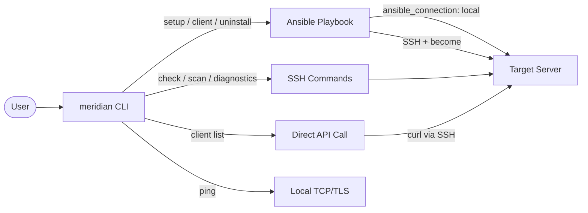
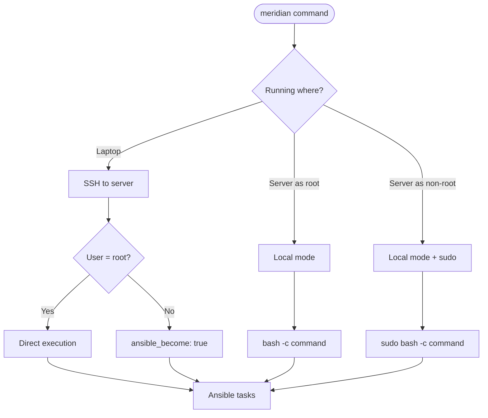
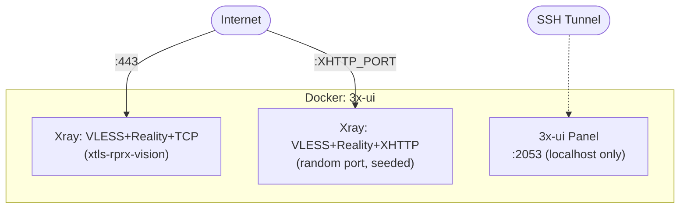
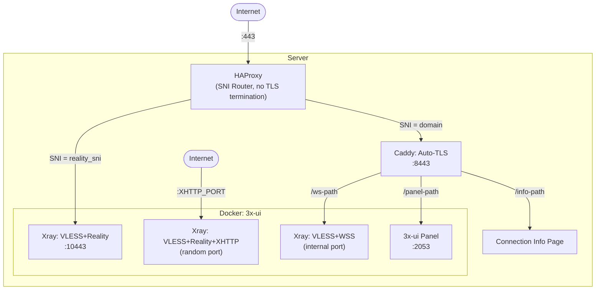
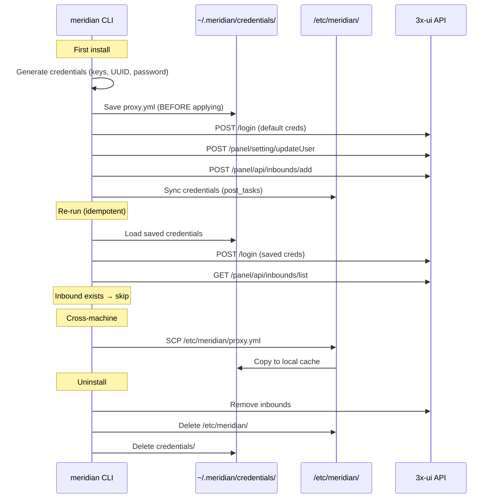
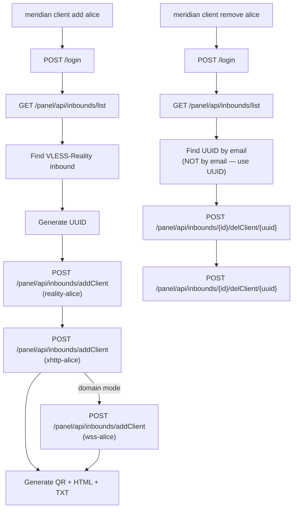
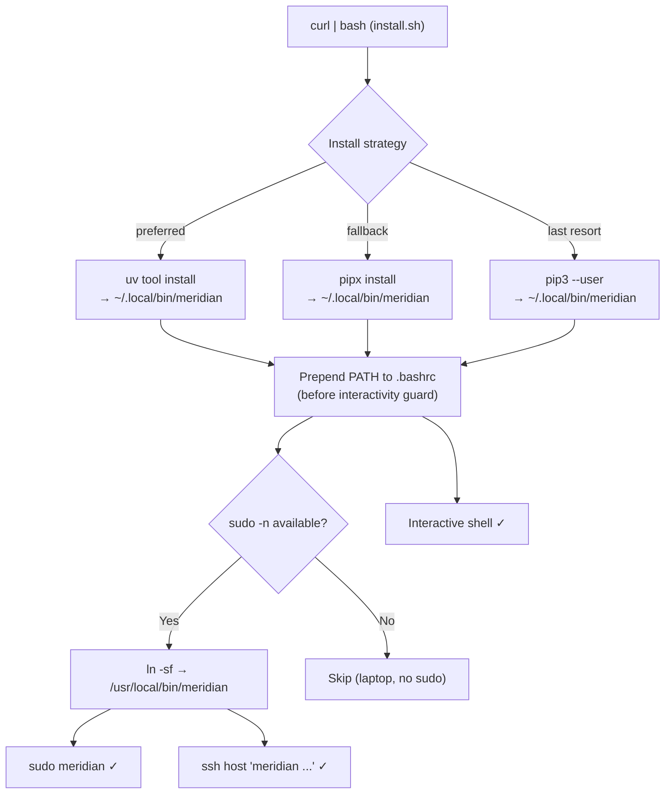
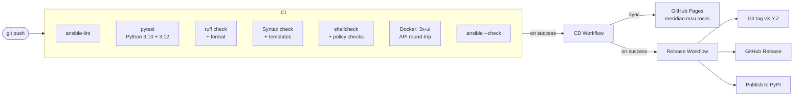

# Meridian — Architecture Diagrams

## CLI Command Flow

## Privilege Escalation

## Standalone Mode — No Domain

## Standalone Mode — Domain

## Credential Lifecycle

## Client Management

## Install & PATH Resolution

## CI/CD Pipeline

