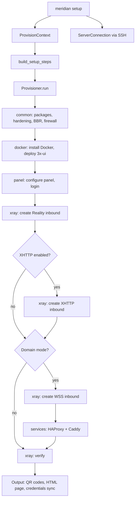

# Architecture

Meridian is a CLI tool that deploys censorship-resistant VLESS+Reality proxy servers. It connects to a VPS via SSH using a pure-Python provisioner, configures Docker/Xray/HAProxy/Caddy, and manages clients through the 3x-ui panel API. Designed for semi-technical users who share VPN access with less technical people.

## Component overview

```
User's laptop                     VPS Server (Debian/Ubuntu)
┌──────────────────┐              ┌─────────────────────────┐
│ meridian CLI     │──── SSH ────>│ Docker: 3x-ui + Xray    │
│ (Python/Typer)   │              │                         │
│                  │── API ──────>│ HAProxy :443 (SNI route) │
│ provision/       │              │ Caddy (auto-TLS)        │
│  (pure-Python    │              │                         │
│   steps via SSH) │              │ Credentials:            │
│                  │              │ /etc/meridian/           │
│ ~/.meridian/     │<── sync ────│                         │
│  credentials/    │              └─────────────────────────┘
│  servers         │
└──────────────────┘
```

## Provisioner architecture

`meridian setup` uses a pure-Python provisioner (no Ansible). The pipeline:



### Key abstractions

| Abstraction | File | Purpose |
|-------------|------|---------|
| `Step` | `provision/steps.py` | Protocol: `run(conn, ctx) -> StepResult` |
| `StepResult` | `provision/steps.py` | Status (`ok`/`changed`/`skipped`/`failed`) + detail |
| `ProvisionContext` | `provision/steps.py` | Typed config (IP, domain, SNI, flags) + inter-step state |
| `Provisioner` | `provision/steps.py` | Runs steps sequentially with Rich spinner output |
| `ServerConnection` | `ssh.py` | SSH command execution wrapper |
| `PanelClient` | `panel.py` | 3x-ui REST API via SSH curl |

### Step modules

| Module | Steps | What they do |
|--------|-------|-------------|
| `provision/common.py` | `InstallPackages`, `HardenSSH`, `ConfigureBBR`, `ConfigureFirewall`, etc. | OS-level setup |
| `provision/docker.py` | `InstallDocker`, `Deploy3xui` | Docker + 3x-ui container |
| `provision/panel.py` | `ConfigurePanel`, `LoginToPanel` | Panel credentials, API login |
| `provision/xray.py` | `CreateRealityInbound`, `CreateXHTTPInbound`, `CreateWSSInbound`, `VerifyXray` | Inbound configuration via 3x-ui API |
| `provision/services.py` | `InstallHAProxy`, `InstallCaddy` | Domain mode services |
| `provision/uninstall.py` | Uninstall steps | Clean removal |

## Key files to read first

| File | Purpose |
|------|---------|
| `src/meridian/cli.py` | Entry point, all subcommands registered here |
| `src/meridian/commands/setup.py` | Interactive wizard + provisioner execution |
| `src/meridian/provision/__init__.py` | `build_setup_steps()` — assembles the step pipeline |
| `src/meridian/provision/steps.py` | Core abstractions: `Step`, `StepResult`, `ProvisionContext`, `Provisioner` |
| `src/meridian/credentials.py` | `ServerCredentials` dataclass (YAML load/save) |
| `src/meridian/ssh.py` | SSH connection, local mode detection, `tcp_connect` |
| `src/meridian/panel.py` | `PanelClient`: 3x-ui REST API wrapper via SSH |
| `src/meridian/protocols.py` | Protocol ABC + inbound type registry |
| `tests/test_cli.py` | CLI smoke tests (good for understanding available commands) |

## What happens during `meridian setup`

1. CLI resolves server IP (argument, saved server, or interactive prompt)
2. CLI checks SSH connectivity, detects if running on the server itself
3. Interactive wizard prompts for domain, SNI, XHTTP (unless `--yes`)
4. CLI creates `ProvisionContext` with typed config and `ServerConnection`
5. `build_setup_steps()` assembles the step pipeline based on flags
6. `Provisioner.run()` executes each step with a Rich spinner
7. Steps install Docker, deploy 3x-ui, generate x25519 keys
8. Steps configure VLESS+Reality inbound via 3x-ui REST API
9. If domain: steps add HAProxy (SNI routing), Caddy (TLS), VLESS+WSS (CDN fallback)
10. Steps harden server: UFW firewall, SSH key-only, BBR congestion control
11. Output: QR codes + HTML connection page with client links
12. Credentials synced to `/etc/meridian/` on the server (source of truth)

## Credential lifecycle

- **Server** (`/etc/meridian/proxy.yml`) is the source of truth
- **Local** (`~/.meridian/credentials/<IP>/proxy.yml`) is a cache
- Provisioner syncs local -> server after every run
- CLI fetches from server via SSH when local cache is missing
- `meridian server add IP` pulls credentials from server to local cache
- `meridian uninstall` deletes both server and local copies

## Critical gotchas

These are the top things that will break if you are not careful:

1. **3x-ui login uses form-urlencoded.** `POST /login` MUST use form-urlencoded (URL-encoded body). All other API calls (inbounds, clients, settings) use JSON. `PanelClient` handles this distinction.

2. **`settings` field is a JSON string inside JSON body.** The 3x-ui Go struct uses `string` type for `settings`, `streamSettings`, `sniffing`. When sending JSON to the API, these fields must be JSON-serialized strings, not nested objects.

3. **Delete client by UUID, not email.** The 3x-ui API endpoint `delClient/{uuid}` works. Deleting by email silently succeeds without actually removing the client. `PanelClient.remove_client()` handles this correctly.

4. **Client email naming convention.** Clients map to 3x-ui emails as `reality-{name}`, `wss-{name}`, `xhttp-{name}`. The first client uses `reality-default`. This convention is shared between `protocols.py` and `PanelClient`.

5. **`shlex.quote()` for all SSH command interpolation.** All values passed into shell command strings via `conn.run()` must be quoted. This is critical because `needs_sudo` escalates to root via `sudo -n bash -c`.

## Testing

```bash
make ci            # Full local CI: lint + format + test + mypy + template rendering
make test          # pytest only
make lint          # ruff check + ruff format --check
make typecheck     # mypy
```

CI cannot test actual deployments. For that, use a real VPS and run the full uninstall -> install cycle. Integration tests (`test_integration_3xui.py`) require a running 3x-ui Docker container and are auto-skipped when the container is not available.
