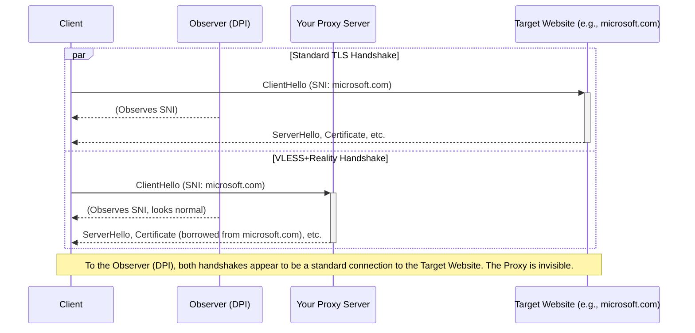
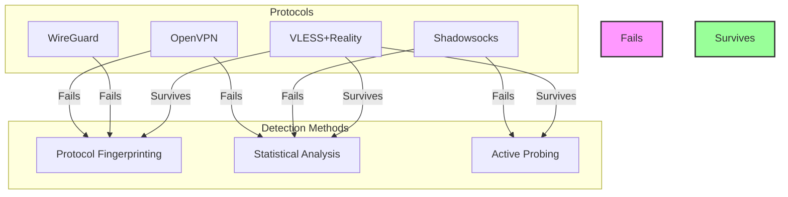

For years, a quiet battle has been waged across the global internet. On one side, state-level censorship systems, armed with sophisticated Deep Packet Inspection (DPI) technology, work to control and restrict the flow of information. On the other, developers and users of circumvention tools constantly innovate to keep access open. This technological arms race has seen protocols rise and fall, each new method of detection met with a new method of evasion. Today, that race has reached a new stage, and the tools that worked yesterday are no longer sufficient.

Older protocols, once the standard for secure internet access, now find themselves outmaneuvered. The techniques that made them effective have become liabilities, easily flagged by modern censors. To understand why, we need to look at how detection actually works in 2026. It is not a single method, but a combination of approaches that work together to identify and block unwanted traffic.

### How modern DPI identifies your traffic

At the heart of modern internet censorship is **Deep Packet Inspection**. Unlike older firewalls that only looked at the headers of a data packet (the source, destination, and port), DPI systems examine the entire packet, including its payload. This allows them to identify the specific protocol being used, even if it is encrypted. They employ three primary techniques to do this.

First is **protocol fingerprinting**. Every protocol has a unique structure, a digital signature. OpenVPN, for example, has a distinct handshake process and packet structure that is easily recognizable. Even without seeing the content, a DPI system can identify the "shape" of the traffic as it flows by. It looks for specific byte patterns, header values, or sequences of communication that act as a dead giveaway. Think of it like recognizing a car by its silhouette, even at a distance. You do not need to see the driver to know it is a sports car.

Second is **statistical traffic analysis**. Censors analyze the patterns of your internet usage. They look at the size of packets, the timing between them, and the overall volume of data being sent and received. A video stream looks different from web browsing, and a file download has a different signature than an interactive chat session. VPN traffic, with its consistent and heavily encrypted data flow, often creates a statistical anomaly that stands out from normal, unencrypted web traffic. This method does not identify the specific protocol, but it flags the connection as suspicious, marking it for further inspection or outright blocking.

Third, and most aggressive, is **active probing**. If a DPI system suspects a server is hosting a proxy, it will not just passively observe. It will actively test that suspicion by sending its own specially crafted packets to the server's IP address. It behaves like a client trying to connect, speaking the language of various known protocols. If the server responds in the expected way for a known proxy protocol, its cover is blown. The censor has confirmed its suspicion, and the server’s IP address is immediately added to a blocklist. This is the digital equivalent of a police officer knocking on a door and asking if an illegal speakeasy is operating inside.

These three methods, used in combination, have made the internet a hostile environment for older protocols. They were designed for a different era, and their defenses are no longer adequate.

### Why older protocols fall short in 2026

The protocols that many people still rely on were not designed with modern DPI in mind. **OpenVPN**, for a long time the gold standard, is now trivial to detect. Its handshake is a fixed, recognizable process that gives it away instantly. While it is a secure and stable protocol, its high visibility makes it an easy target for protocol fingerprinting. Its significant packet overhead also creates a distinct statistical signature.

**WireGuard**, known for its speed and simplicity, also has a tell-tale signature. Its initial handshake packets have a fixed size and structure. While it is much faster and more efficient than OpenVPN, it was designed for security and performance, not for stealth. Censors have learned to recognize its handshake, and active probes can easily confirm its presence. It was built to be a better VPN, not an invisible one, and that distinction is critical.

**Shadowsocks**, a protocol that gained popularity for its simplicity, relies on a pre-shared key for encryption. While this makes it lightweight, it also makes it vulnerable. The initial packets have a high degree of entropy (randomness) that, ironically, makes them stand out against normal web traffic. More advanced versions have tried to mitigate this, but the core design is susceptible to statistical analysis and active probing. If a censor sends a malformed Shadowsocks request to a server, the server
's specific error response can confirm its existence. Reported detection rates tell the story: OpenVPN and WireGuard are blocked at nearly 100% in restrictive environments, with Shadowsocks not far behind at 95%.

This is where **VLESS+Reality** changes the game. It was designed from the ground up to be undetectable, learning from the weaknesses of its predecessors.

### VLESS+Reality: a design for undetectability

The core innovation of VLESS and its companion protocol, Reality, is not just adding another layer of encryption. Instead, it is about making the proxy traffic look identical to the normal, everyday HTTPS traffic that makes up the majority of the modern web. It achieves this through a few key technical design choices.

The most important is how Reality handles TLS, the encryption that secures websites. Instead of generating its own self-signed certificate, which is an immediate red flag for a censor, Reality uses the identity of a real, high-traffic website as camouflage. When an unauthorized party—such as a censor's active probe—connects to the proxy server, Reality forwards the connection to the real target site (e.g., `microsoft.com`). The prober receives a genuine response from the real site, complete with its valid TLS certificate. There is nothing to distinguish this from a normal connection. Only clients that possess the correct x25519 key can authenticate with the server and establish the actual VLESS tunnel. To any outside observer, like a DPI system, the server appears to be a transparent relay to a legitimate website.

This defeats active probing. If a censor tries to connect to your server's IP address, the connection is proxied to the real target site, and the censor receives an authentic response. There is no tell-tale error message, no protocol-specific response. The server perfectly impersonates an innocent, high-traffic web server.

Here is how that handshake compares to a standard HTTPS connection. They are, by design, nearly identical.

Furthermore, the VLESS protocol itself is incredibly lightweight. It has no “magic numbers” or fixed byte patterns that can be used for fingerprinting. The protocol header is minimal, adding only a few dozen bytes to each packet. This makes it much harder to distinguish from other encrypted traffic using statistical analysis. It blends in with the noise of the internet.

### The final piece: impersonating Chrome with uTLS

Even with a perfect TLS handshake, there is one more detail that can give a proxy away: the **TLS Client Hello fingerprint**. Every web browser (Chrome, Firefox, Safari) has a unique way of constructing its initial `ClientHello` packet. The combination of ciphers it supports, the extensions it uses, and the order in which they are presented creates a unique fingerprint. Censors can and do use these fingerprints to identify traffic from non-browser applications.

This is where **uTLS** comes in. It is a library that allows an application to perfectly mimic the TLS fingerprint of a specific browser. VLESS+Reality uses uTLS to make its `ClientHello` packets bit-for-bit identical to those sent by the latest version of Google Chrome. When your client connects, the first packet it sends is indistinguishable from a Chrome browser connecting to a website. This defeats the last major vector for fingerprinting, leaving the censor with nothing to grab onto.

### Real-world survival rates

The result of this design is a protocol that is exceptionally difficult to detect and block. While older protocols are easily identified, VLESS+Reality has a reported survival rate of over 95% even in the most restrictive network environments. It survives because it does not try to hide its encryption; it hides its identity in plain sight, masquerading as the most common and essential traffic on the internet.

This diagram shows how different protocols stack up against modern detection methods.

The arms race will undoubtedly continue. Censors will develop new techniques, and protocol developers will find new ways to evade them. But for now, the evidence is clear. Protocols that rely on obvious handshakes or statistical anomalies are fighting a losing battle. The future of circumvention lies in plausible deniability, in blending in so perfectly with normal traffic that you cannot be distinguished from it.

VLESS+Reality is the current pinnacle of that design philosophy. It is not just another VPN protocol; it is a masterclass in camouflage. For anyone who needs reliable, unrestricted internet access in 2026, it is the only choice that makes sense.

If you need to set up a proxy for yourself, your family, or your friends, you need a tool that uses the best protocol available. Meridian was built from the ground up to deploy VLESS+Reality servers in a single command, with security and ease-of-use as its top priorities. To learn more about its hardened architecture, check out the [Meridian security documentation](https://getmeridian.org/docs/en/security). If you are ready to get started, you can deploy your own server in minutes. The internet is for everyone, and with the right tools, we can keep it that way.
