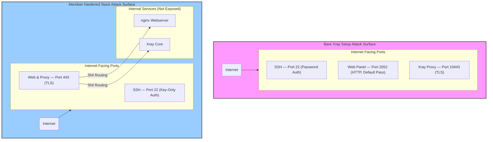
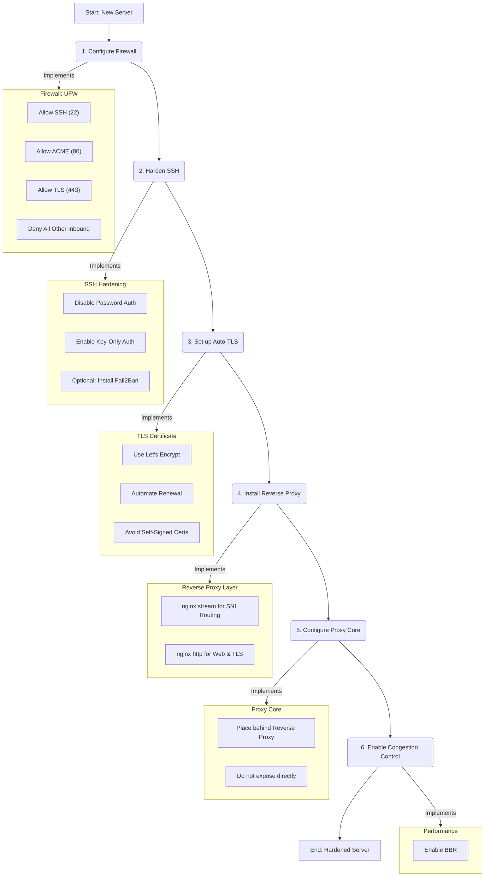

Most tutorials for setting up a self-hosted proxy end the moment the connection works. You get a QR code, the client connects, and the guide declares victory with a triumphant "it works!" This approach is a dangerous trap. A working proxy is not a secure proxy, and the internet of 2026 is a far more hostile environment than many users realize. Within minutes of a new server going online, it is bombarded by automated scanners probing for any weakness. Leaving a server in its default, post-installation state is like leaving your front door unlocked and wide open with a welcome mat for these automated attackers. The real work of securing your server begins *after* the proxy is running, and it involves a deliberate process of shrinking your server's visibility and closing potential entry points.

This "it works" trap is particularly prevalent with popular, user-friendly management panels. While these tools make proxy administration accessible, they often prioritize ease of use over security out of the box. The result is a significant **attack surface**, which is the sum of all possible points an attacker could use to find and compromise a system. For a typical self-hosted proxy, this surface is surprisingly large. It includes not just the proxy port itself, but also the SSH port for server administration and any web-based management tools. Without deliberate hardening, each of these is a potential entry point for trouble.

A prime example can be seen with 3x-ui, a widely used panel for managing Xray-core. Its convenience is undeniable, but its default settings can leave a server dangerously exposed. For a detailed comparison of how different tools handle security defaults, see our [proxy tools comparison](/blog/05-proxy-tools-comparison/). For years, it installed with the default credentials `admin:admin`, a fact known to every automated scanner on the web. The management panel itself often runs on an exposed, unencrypted HTTP port, sending login credentials in plain text. Furthermore, its Telegram bot integration has been a source of token leaks, where the secret key used to control the bot could be discovered by an attacker, giving them administrative control. These are not theoretical risks; they are documented vulnerabilities that have led to compromised servers, turning a tool for privacy into a liability.

### Firewall configuration that actually matters

The single most effective step to reduce a server's attack surface is a properly configured firewall. It is also the one most people skip, perhaps because it feels intimidating or they assume their cloud provider handles it. Using a tool like **UFW (Uncomplicated Firewall)** on Linux simplifies this immensely. The core principle is to deny all incoming traffic by default and only open the specific ports you absolutely need. For a hardened proxy server, this means allowing traffic only on port 22 (for your own SSH access), port 80 (for ACME certificate challenges from Let's Encrypt), and port 443 (for TLS-encrypted web and proxy traffic). Everything else should be blocked. This simple but powerful rule prevents automated scanners and opportunistic attackers from ever reaching vulnerable services that might be running on other ports, effectively making them invisible to the outside world. A simple `ufw allow 22`, `ufw allow 80`, and `ufw allow 443` followed by `ufw enable` is all it takes to lock down a server.

### SSH hardening: why key-only auth is non-negotiable

Every new virtual private server (VPS) comes with SSH access enabled, and almost universally, it allows password-based authentication by default. This is a huge liability. Automated bots constantly scan the entire internet for servers with an open SSH port (port 22), and the moment they find one, they begin a relentless brute-force attack, trying thousands of common passwords. The only robust solution is to disable password authentication entirely and use **SSH keys** instead. An SSH key pair provides a cryptographic proof of identity that is practically impossible to brute-force. While tools like `fail2ban` can help by blocking IPs that have too many failed login attempts, they are a reactive measure. Switching to key-only authentication is a proactive and definitive security upgrade that shuts the door on brute-force attacks completely. It's the digital equivalent of replacing a simple key lock with a complex, unpickable one.

### TLS done right: the problem with self-signed shortcuts

Transport Layer Security (TLS) is what encrypts your proxy traffic, making it look like normal HTTPS browsing. Many guides and one-click scripts suggest using self-signed certificates because they are quick and easy to generate. This is a critical mistake. While self-signed certificates do encrypt traffic, they are a major red flag for network observers and censorship systems. A real website has a certificate signed by a trusted Certificate Authority (CA) like Let's Encrypt or Cloudflare. A self-signed certificate is an anomaly that stands out, and in any high-scrutiny network environment, anomalies attract unwanted attention. The modern solution is to use **Let's Encrypt**, a free, automated, and trusted CA. Tools like **acme.sh** can automatically obtain and renew valid TLS certificates, making your proxy's traffic cryptographically indistinguishable from that of any other secure website on the internet. This is not just about appearances; it's about blending in with the noise of the internet.

### The reverse proxy layer: hiding in plain sight

This brings us to the core of a modern, hardened architecture: the reverse proxy. Instead of exposing your proxy core (like Xray) directly to the internet on its own port, you place a web server in front of it. In the Meridian stack, **nginx** handles all traffic. Its **stream module** sits on the frontline at port 443 and acts as a smart traffic director. It inspects the incoming TLS connection's **Server Name Indication (SNI)** field, which indicates the hostname the client is trying to reach. Based on this SNI, it routes the traffic to the appropriate backend service. If it's a VLESS+Reality connection destined for the Reality SNI target (e.g., `www.microsoft.com`), it forwards the traffic directly to the Xray core. If it's any other HTTPS request, it passes it to nginx's **http module**, which serves a harmless decoy webpage. This setup means your proxy service doesn't occupy a suspicious, non-standard port; it's hidden behind the standard web port, sharing it with what appears to be a normal website. This makes it much harder for an observer to identify the server's true purpose. To any outside observer, your server looks like a regular website, not a proxy.

### The free performance win nobody configures

Server hardening isn't just about security; it's also about performance and reliability. One of the most impactful yet consistently overlooked tweaks is enabling **BBR congestion control**. Developed by Google, BBR is a smarter algorithm for managing how a server sends data over the network. Traditional algorithms, like the default Cubic algorithm used by Linux, often slow down packet transmission too aggressively when they detect network congestion, leading to lower throughput and higher latency. BBR, on the other hand, builds a model of the network path to maximize bandwidth utilization while keeping latency low. For a proxy server, which is all about moving data as quickly as possible, enabling BBR can provide a significant and noticeable performance boost with a single command. It's a free win that many server administrators simply forget to claim. The difference can be especially noticeable on long-distance or unstable connections.

Manually configuring all these components—UFW, SSH, Let's Encrypt, nginx, and BBR—requires dozens of steps and careful attention to detail. It's a significant undertaking, and a single misconfiguration in one component can undermine the security of the entire setup. This is precisely the problem Meridian was built to solve. The `meridian deploy` command automates this entire hardening process from start to finish. It configures nginx for SNI routing and web serving, sets up the firewall, hardens SSH, enables BBR, and sets up automatic TLS renewal without any manual intervention. It takes the established best practices for a secure and performant proxy and makes them the default, ensuring your server is locked down from the moment it goes online.

To learn more about the specific security choices and architecture behind Meridian, check out our [Security](https://getmeridian.org/docs/en/security) and [Architecture](https://getmeridian.org/docs/en/architecture) documentation. If you're ready to deploy a hardened proxy in minutes, see our [Getting Started](https://getmeridian.org/docs/en/getting-started) guide.
