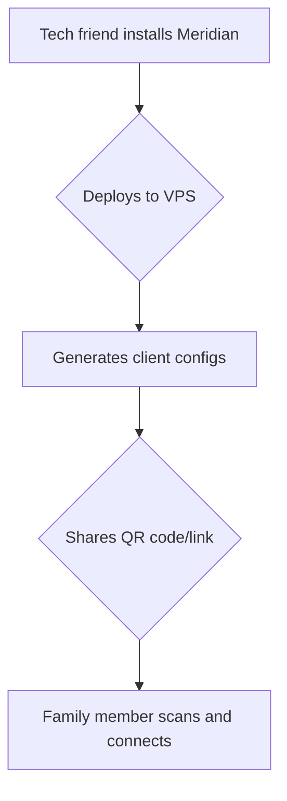
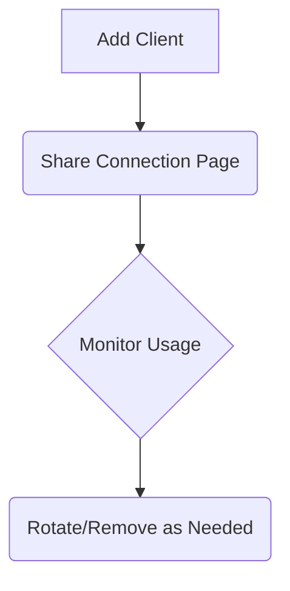

If you work in technology, you are likely familiar with the message. It arrives through various messaging apps or as a call from an unrecognized number. It might be a relative, an old friend from university, or a colleague of your parent. The request is consistently the same: “Hello, I know you are skilled with computers. Can you assist me in setting up a VPN?”

In that moment, you become the unofficial IT support for your extended social network. You are the designated tech expert, the individual they rely on for navigating the complexities of the digital world. This role is often assumed out of a desire to help, but it carries a significant degree of responsibility. You want to provide a solution that is not only effective but also secure, dependable, and does not result in a continuous stream of support requests for you. Your reputation as the 'tech friend' is on the line, and you want to deliver a solution that genuinely works well for the people who trust you.

### The limitations of commercial VPNs

Recommending a commercial Virtual Private Network (VPN) service might seem like the most straightforward solution. The process appears simple: instruct them to download an application, purchase a subscription, and press a button. However, this approach is not always suitable for everyone, and as the tech-savvy friend, you know the devil is in the details. The primary concern is trust. When using a commercial VPN, all of your internet traffic is routed through a third-party company. This requires placing your trust in their privacy policies, their security measures, and their commitment not to record your online activities. For individuals seeking to enhance their digital security, entrusting their data to another corporation can feel counterintuitive. Many services have been found to log user data despite their claims, and you are essentially asking your loved ones to trust a faceless company with their entire digital footprint.

Performance is another significant factor. Commercial VPN servers are typically shared among thousands of users, which can lead to network congestion and reduced internet speeds, especially during peak hours. Furthermore, the IP addresses associated with these services are widely known and frequently blocked by online platforms and services that restrict access based on geographic location or network origin. This can undermine the very purpose of using a VPN, leading to frustrating experiences where streaming services or even regular websites fail to load. Lastly, there is the matter of cost. While a single subscription may seem affordable, the expense can become substantial when providing access for multiple family members. The cumulative cost of five or six separate accounts can be a considerable financial burden, and free services are often a privacy nightmare, funded by selling user data.

### The advantages of a private, self-hosted proxy

This is where a self-hosted proxy offers a compelling alternative. Instead of depending on a commercial service, you can establish your own private server. This approach provides you with complete control over your data and infrastructure. You own the server, you manage who has access, and you have full transparency into how your data is handled. You obtain a dedicated IP address that is not associated with any blocklists, and you can utilize modern protocols like VLESS+Reality, which are designed to be more difficult to detect and block. Perhaps the most significant benefit is the ability to share a single server with your entire family for a single, low monthly fee. This is not just a technical solution; it's an economic one.

While this may sound like a complex undertaking, modern tools have made the process of deploying a private proxy server nearly as simple as using a commercial VPN. You can have a secure, private, and shareable internet connection operational in a matter of minutes. This is the power of open-source software and the community that builds it. You are no longer limited to the choices offered by large corporations; you can build a solution tailored to your specific needs and the needs of your family and friends. For more on the technical advantages of protocols like VLESS+Reality, see our deep-dive post on [why it's the last protocol you'll need](/blog/01-why-vless-reality/).

### From zero to a working proxy in five minutes

Let's examine the deployment process in detail. The first step is to acquire a Virtual Private Server (VPS), which is a small, inexpensive server available from numerous cloud hosting providers. For a personal proxy, a basic server costing around $5 per month is generally sufficient. Choosing the right VPS provider is an important step, and we have a [detailed guide](/blog/06-choosing-vps/) to help you make an informed decision. Once you have obtained your VPS and its corresponding IP address, you can use a tool like Meridian to automate the entire deployment process.

Meridian is an open-source orchestration tool that configures a hardened, censorship-resistant proxy server with a single command. After connecting to your new server via SSH, you can initiate the installation by running the following command:

```bash
curl -sSf https://getmeridian.org/install.sh | bash
```

Following the installation, you can begin the deployment process:

```bash
meridian deploy
```

The tool will then prompt you for a few configuration details, such as a password for the administrative panel. Once you provide the necessary information, Meridian will proceed to install all the required software components, configure the firewall, set up automatic TLS certificates, and implement various security hardening measures. Within approximately five minutes, you will receive a confirmation that the deployment has been successfully completed, along with the connection details for your new proxy server. The full deployment process is covered in our [getting started documentation](https://getmeridian.org/docs/en/getting-started).

### Solving the handoff problem

This is the stage where many self-hosted solutions become impractical for non-technical users. You may have a fully functional proxy server, but how do you enable your family and friends to connect to it? It is unreasonable to expect individuals without a technical background to edit complex configuration files or manually copy long strings of text. This is known as the handoff problem, and it represents the most significant obstacle to sharing self-hosted services with a wider audience. This is where the user experience design of your solution becomes paramount.

Meridian addresses this challenge with a simple and intuitive connection page. For each individual you wish to share the service with, you can generate a unique access link. This link directs them to a Progressive Web App (PWA) that can be accessed on their mobile device or computer. The page displays a QR code and a one-click connection link. All the user needs to do is scan the QR code with their preferred application or click the link to establish a connection. This streamlined process requires no technical expertise on the part of the end-user. You can even [see a demo](/demo/) of the connection page to understand the user experience.

Here is a flowchart illustrating the complete user journey:



### Managing access to your server

Creating individual configurations for each user is a fundamental aspect of maintaining good security and effective management. If all users share the same access key, it becomes impossible to determine who is using the service, and you cannot revoke access for a single individual without disrupting the service for everyone else. Meridian simplifies the process of managing individual clients, as detailed in our [client management documentation](https://getmeridian.org/docs/en/client-management).

You can add a new client using a straightforward command:

```bash
meridian client add <name>
```

This command will generate a new, unique connection page for the client. You can also list all of your clients to view who has access and monitor their data usage. If an individual no longer requires access, or if a device is lost or stolen, you can remove their client with equal ease:

```bash
meridian client remove <name>
```

This client management lifecycle ensures that you always maintain complete control over who is able to use your private server. This level of granular control is something that is often missing from commercial VPN services, where you are limited to a certain number of simultaneous connections and have no visibility into individual usage.



### What to do when things go wrong

Even with a well-configured setup, occasional issues can arise. The most common problem is the server's IP address being blocked by network administrators or online services. With a commercial VPN, you would typically need to contact customer support and wait for a resolution. With a self-hosted proxy, you have the ability to resolve the issue yourself within minutes. The process is straightforward: acquire a new VPS with a new IP address, and then execute the Meridian deployment command again, specifying the new IP address. Our [recovery documentation](https://getmeridian.org/docs/en/recovery) explains this in more detail.

```bash
meridian deploy <NEW_IP_ADDRESS>
```

After deploying to the new server, you will need to re-add your clients with `meridian client add <name>` and share the updated connection pages. While this requires a few extra steps on your end, the process is fast and straightforward. Your users simply scan the new QR code or click the new link, and they are back online. This rapid rebuild workflow is a key feature of a resilient and reliable self-hosted setup. It transforms a potentially disruptive event into a minor inconvenience that you can resolve quickly and efficiently.

### The five-dollar-a-month math

Finally, let's consider the financial aspect. A dependable VPS from a reputable provider such as DigitalOcean or Vultr typically costs around $5 per month. This single server can comfortably accommodate 5-10 users, depending on their individual usage patterns. When you compare this to the cost of multiple commercial VPN subscriptions, the financial savings become readily apparent. You are not only obtaining a superior and more private solution, but you are also doing so at a significantly lower cost. This is the power of disintermediation – removing the middleman and taking control of your own infrastructure.

Being the designated tech expert for your friends and family is a responsibility, but it is also an opportunity to provide meaningful assistance to the people you care about. With the appropriate tools, you can offer them a secure and private gateway to the internet, free from the compromises and limitations of commercial services. For more detailed information on getting started with your own private proxy server, please refer to the [Meridian documentation](https://getmeridian.org/docs/en/getting-started).
