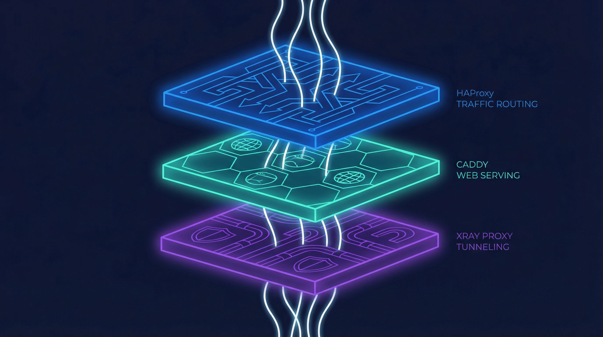
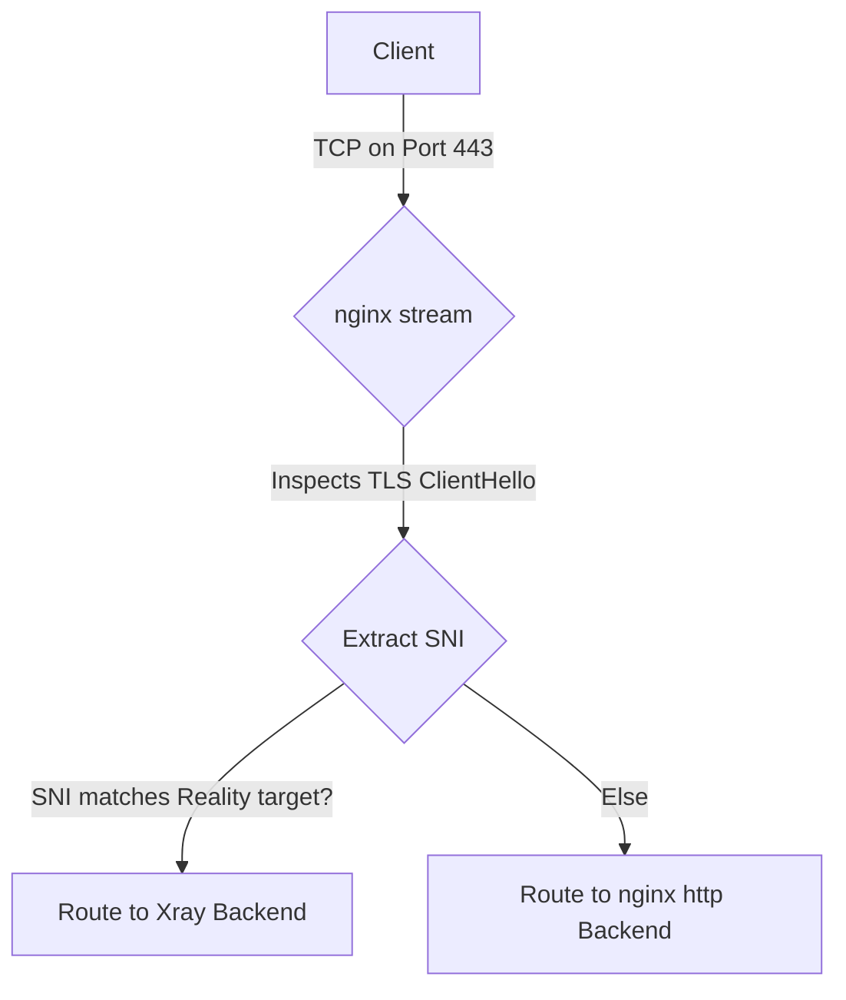
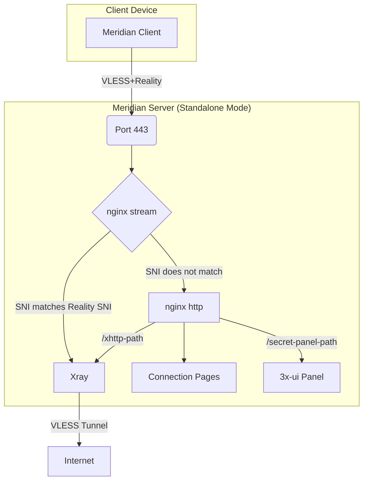
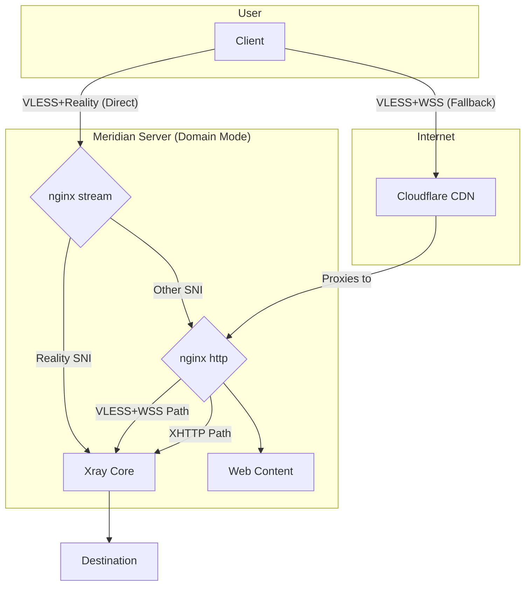
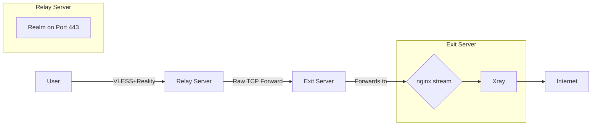

When building a personal proxy server, the simplest approach seems obvious: just run a proxy process like Xray on port 443 and forward the configuration to your clients. This setup can work, but it presents immediate problems. Without a real web server, anyone visiting your server's IP address in a browser gets a connection error. This is a red flag for any curious observer. It also means you cannot easily host connection pages for your users or access a web-based management panel over standard HTTPS.

A server that only runs a proxy protocol on its primary port behaves unnaturally. It fails the "visit it in a browser" test. This makes it easier to identify through passive reconnaissance. To build a more resilient and plausible system, you need multiple services to coexist on the same port. Meridian solves this with a two-layer architecture built on just two components: **nginx** for all traffic handling — SNI routing, TLS termination, web serving, and reverse proxying — and **Xray** for the core proxy tunnel. This design allows a single server to look and act like a normal website while securely tunneling traffic for those who have the key.

### Why nginx?

The choice of nginx was not accidental. Many proxy deployment tools scatter responsibilities across multiple services — a load balancer here, a web server there, a reverse proxy somewhere else. Each additional binary is another thing to install, configure, update, and debug. Meridian takes a different approach: use one tool that already does everything well.

nginx is the most battle-tested web server on the internet, powering a significant fraction of all websites globally. It ships with two modules that, combined, cover every traffic-handling need Meridian has. The **stream module** operates at layer 4 (TCP), inspecting TLS Client Hello packets to route connections by SNI hostname — without terminating the encryption. The **http module** operates at layer 7, handling TLS termination, static file serving, and reverse proxying. One binary, one configuration language, two modules, zero compromises.

This consolidation has practical benefits beyond simplicity. There is one service to monitor, one set of logs, one reload command. Certificate management is handled by **acme.sh**, a lightweight shell-based ACME client that writes certificates to disk; nginx picks them up on reload. The entire web-facing surface of the server is controlled by two configuration files that Meridian writes to `/etc/nginx/conf.d/` — never touching the main `nginx.conf`, so it coexists cleanly with any existing setup on the server.

### The SNI routing layer: nginx stream as a traffic dispatcher

The central challenge is to run both a web server and a VLESS+Reality proxy on port 443. The key to achieving this without conflicts is to inspect incoming connections and route them based on what service the client is asking for. This is where nginx's stream module comes in. It operates as a layer 4 router, examining the initial packet of a TLS connection — the ClientHello — without decrypting the traffic itself.

Contained within this first packet is the **Server Name Indication (SNI)**, a field that tells the server which website the client is trying to reach. The stream module reads this SNI value in plain text. This allows it to make an intelligent routing decision. If the SNI matches the specific target defined in the VLESS+Reality configuration (e.g., `www.microsoft.com`), nginx forwards the raw TCP stream directly to the Xray backend. If it sees any other SNI — including the server's own IP address or domain name — it routes the connection to the nginx http module running on an internal port. This entire process is transparent and happens without terminating the TLS encryption, preserving the end-to-end security of each connection.

This SNI-based routing is the architectural foundation of Meridian. It allows two completely different services to share the most valuable port, 443, making the server's behavior much harder to distinguish from a standard web server. It is a powerful technique that provides flexibility and strengthens the server's defensive posture.

### The TLS and web layer: nginx http handling certificates and content

For all traffic not destined for the Reality proxy, nginx's http module provides the public-facing web presence. Its primary job is to handle TLS termination and serve content. Certificates are managed by **acme.sh**, a lightweight ACME client that runs independently of nginx. In standalone mode (no domain), acme.sh obtains a Let's Encrypt IP certificate using the ACME `shortlived` profile — these certificates have a 6-day validity and are auto-renewed. If IP certificate issuance is not available for a given address, Meridian falls back to a self-signed certificate. In domain mode, acme.sh provisions a standard domain certificate through the HTTP-01 challenge, with nginx serving the challenge files on port 80.

Once nginx http receives a connection (forwarded internally from the stream module on port 8443), it serves several functions. It displays the hosted Progressive Web App (PWA) connection pages, which give users a simple way to import proxy profiles using QR codes. It reverse-proxies **XHTTP** traffic to Xray on a secret URL path — wrapping proxy connections inside ordinary HTTPS requests. And it acts as a reverse proxy for the **3x-ui** management panel, securing it behind a randomized path so it is not discoverable by scanners. All of this happens within a single nginx process, configured through path-based routing rules.

By consolidating all web-facing services under nginx, the architecture remains clean. A single binary handles SNI routing, TLS termination, static file serving, and reverse proxying to multiple backends. There is no chain of separate services to coordinate, no inter-process communication to debug, and no version compatibility matrix to maintain.

### The proxy layer: Xray with Reality doing the actual tunneling

When nginx stream identifies a connection intended for the proxy, it forwards the raw TCP stream to Xray. The Xray process is configured to listen for VLESS+Reality connections on an internal port (10443). Because nginx stream did not terminate the TLS, Xray receives the original ClientHello from the user's device. It then proceeds with the Reality handshake. For unauthorized connections — such as active probes from censors — Xray forwards the traffic to the real target site (e.g., `www.microsoft.com`), which responds with its own genuine certificate. The prober sees an authentic response indistinguishable from a normal connection. Only clients with the correct pre-shared x25519 key can authenticate and establish the VLESS tunnel. To an outside observer, this looks identical to a genuine TLS connection to that destination.

This is the core of the proxy system. Xray handles the VLESS protocol, which is lightweight and designed to be difficult to detect. The **Reality** extension is what makes it so effective. By forwarding unauthorized connections to real, high-reputation websites, it defeats active probing attempts. Any automated system trying to connect to the server will be proxied to the genuine target site, making the server appear innocent. Only a client with the correct pre-shared key and user ID can successfully establish a proxy tunnel. Everyone else is diverted or sees a standard website.

### How XHTTP transport works through nginx

In some restrictive network environments, direct TCP connections on port 443 might be subject to deep packet inspection or throttling, even with TLS. To circumvent this, Meridian offers an XHTTP transport. This wraps the VLESS connection inside standard HTTP requests, reverse-proxied through nginx. Unlike WSS (WebSocket Secure), which maintains a persistent bidirectional connection, XHTTP uses ordinary HTTP request-response exchanges that blend in seamlessly with normal web browsing. From the outside, it looks like regular encrypted web traffic to a normal website.

This is accomplished through nginx's path-based routing. The Meridian client is configured to connect to a specific path on the server, for example, `https://your-server-ip/xhttp-secret-path`. nginx is configured to proxy requests on this path to a localhost-only port where Xray is listening for XHTTP connections. The XHTTP backend is never reachable directly from the internet — no extra external port is exposed. All traffic enters through port 443, gets routed by nginx stream to nginx http, and is then proxied internally to Xray. This allows proxy traffic to blend in with normal web browsing, providing another layer of resilience without needing to open additional ports on the server's firewall.

### Domain mode: adding CDN fallback through Cloudflare

For users who own a domain name, Meridian offers a **domain mode** that enhances resilience further by integrating with a Content Delivery Network (CDN) like Cloudflare. In this configuration, the domain's DNS records point to Cloudflare, and Cloudflare's servers forward traffic to the Meridian server. This provides two key benefits.

First, it hides the server's real IP address. All public-facing traffic goes through Cloudflare's network, making it much harder for censors to find and block the origin server directly. Second, it enables a fallback transport using **VLESS over WebSockets (WSS)**. This traffic flows through Cloudflare's CDN on standard HTTPS ports and looks like normal web traffic to any intermediary. If a user's ISP blocks the server's IP, they can often still connect through the domain and CDN. nginx stream continues to route direct Reality connections to Xray, while nginx http handles both the XHTTP path and the WSS path — proxying WebSocket upgrade requests from Cloudflare to Xray's internal WSS listener.

### The relay architecture: L4 forwarding with Realm

Sometimes, the problem is not reaching the proxy server, but the latency incurred by routing traffic halfway across the world. For users in regions where international connections are slow, Meridian provides a **relay mode**. This allows you to set up a lightweight server in a location geographically closer to the user, which then forwards traffic to the main exit server located elsewhere.

This is achieved using a tool called **Realm**, a high-performance layer 4 TCP forwarder. The relay server runs only Realm on port 443. It does not run Xray or nginx. When a client connects to the relay, Realm instantly forwards the TCP packets to the exit server without inspecting them. The end-to-end TLS encryption between the client and the exit server is preserved. The relay only sees encrypted traffic and has no knowledge of the proxy keys. This provides a simple and secure way to improve performance for users who need a domestic entry point before their traffic is routed internationally.

### Why this stack is harder to detect

The architecture of Meridian is its greatest strength. By consolidating traffic handling into nginx — a web server that already powers a significant portion of the internet — the server's fingerprint is indistinguishable from millions of other websites. When a curious party or an automated scanner probes the server's IP address, they see a real website served by nginx with a valid TLS certificate. They do not receive a suspicious connection reset or a self-signed certificate, which are common giveaways of a simple proxy setup.

Every part of the system is designed to withstand scrutiny. nginx stream routes traffic invisibly at layer 4, never decrypting connections not meant for it. nginx http provides a plausible web front with real certificates, real pages, and real HTTPS responses. And Xray with Reality ensures that only clients with the correct cryptographic keys can access the underlying proxy tunnel. The simplicity of having just two components — nginx and Xray — means fewer moving parts, fewer configuration mistakes, and a smaller attack surface. This separation of concerns makes the entire system more robust, more plausible, and ultimately, more resilient against detection and blocking.

To learn more about the specific configurations and security considerations of this architecture, you can explore the [Meridian architecture documentation](https://getmeridian.org/docs/en/architecture). If you are ready to deploy your own server, our [getting started guide](https://getmeridian.org/docs/en/getting-started) will walk you through the simple installation process.
