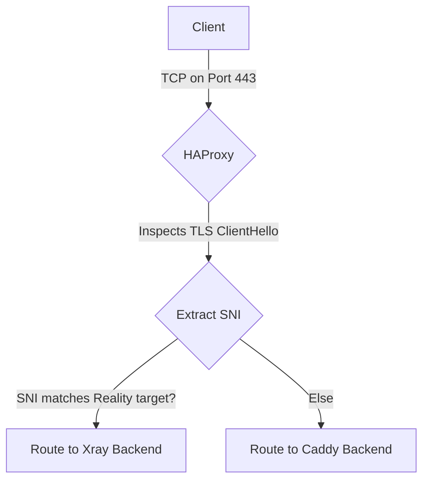
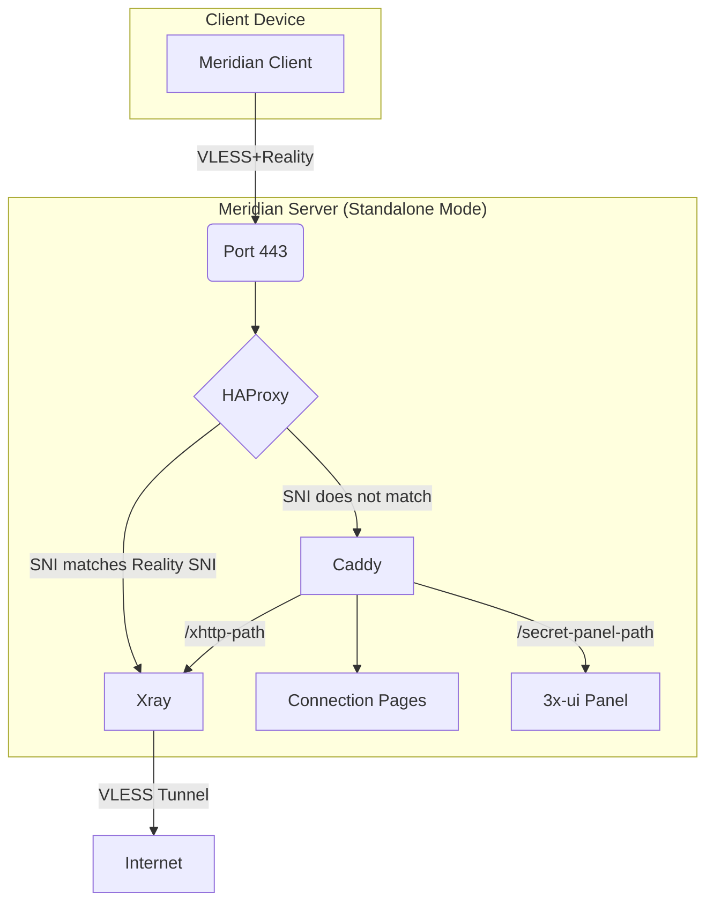
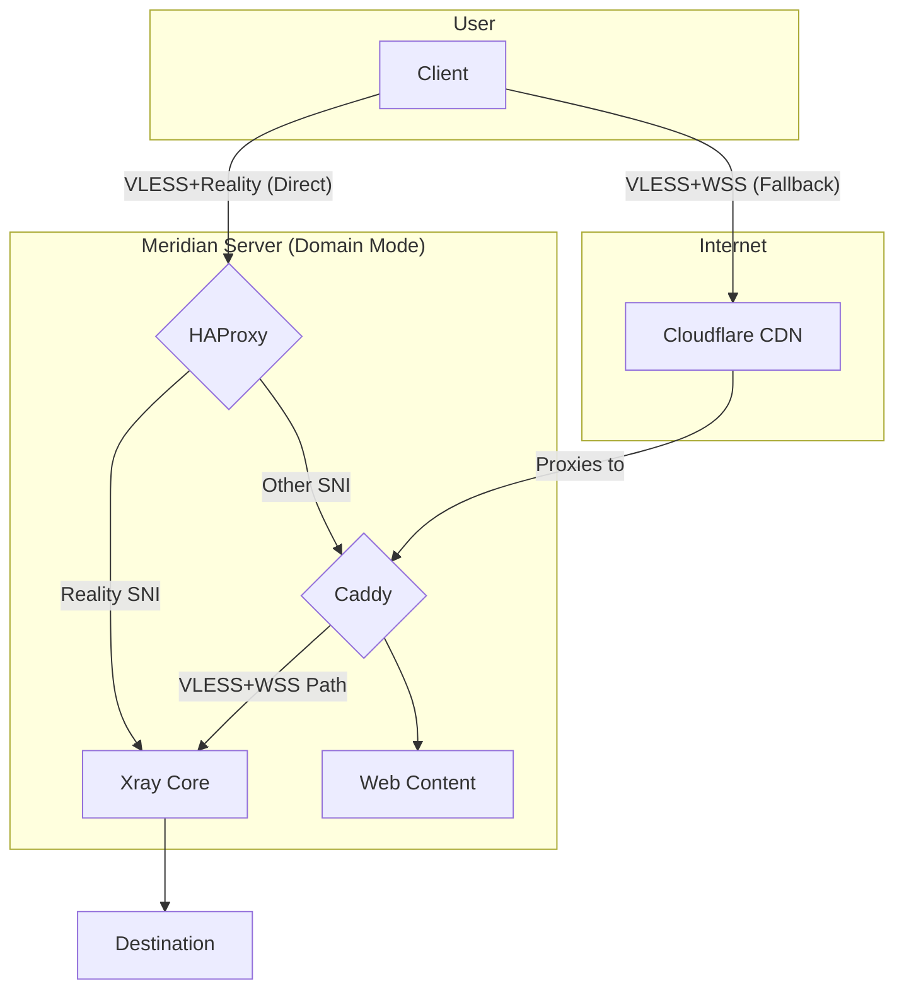
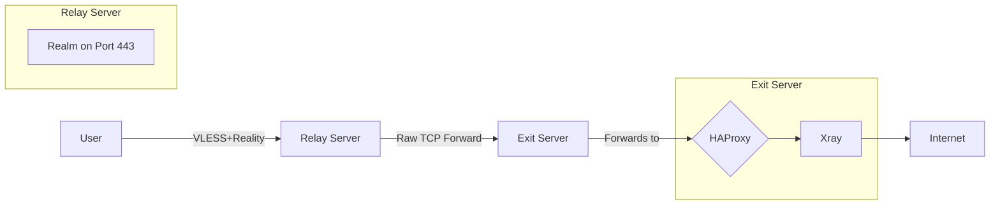

When building a personal proxy server, the simplest approach seems obvious: just run a proxy process like Xray on port 443 and forward the configuration to your clients. This setup can work, but it presents immediate problems. Without a real web server, anyone visiting your server’s IP address in a browser gets a connection error. This is a red flag for any curious observer. It also means you cannot easily host connection pages for your users or access a web-based management panel over standard HTTPS.

A server that only runs a proxy protocol on its primary port behaves unnaturally. It fails the "visit it in a browser" test. This makes it easier to identify through passive reconnaissance. To build a more resilient and plausible system, you need multiple services to coexist on the same port. Meridian solves this by using a sophisticated three-layer architecture, with each component chosen for a specific job. At the front is **HAProxy**, acting as a transparent traffic dispatcher. Behind it, **Caddy** handles all things web-related, and **Xray** manages the core proxy tunnel. This design allows a single server to look and act like a normal web server while securely tunneling traffic for those who have the key.

### The SNI routing layer: HAProxy as a traffic dispatcher

The central challenge is to run both a web server and a VLESS+Reality proxy on port 443. The key to achieving this without conflicts is to inspect incoming connections and route them based on what service the client is asking for. This is where HAProxy comes in. It operates as a layer 4 load balancer, examining the initial packet of a TLS connection—the ClientHello—without decrypting the traffic itself.

Contained within this first packet is the **Server Name Indication (SNI)**, a field that tells the server which website the client is trying to reach. HAProxy can read this SNI value in plain text. This allows it to make an intelligent routing decision. If the SNI matches the specific target defined in the VLESS+Reality configuration (e.g., `www.microsoft.com`), HAProxy forwards the connection directly to the Xray backend. If it sees any other SNI, or no SNI at all, it routes the connection to the Caddy web server. This entire process is transparent and happens without terminating the TLS encryption, preserving the end-to-end security of the connection.

This SNI-based routing is the architectural foundation of Meridian. It allows two completely different services to share the most valuable port, 443, making the server’s behavior much harder to distinguish from a standard web server. It is a powerful technique that provides flexibility and strengthens the server’s defensive posture.

### The TLS and web layer: Caddy handling certificates and content

For all traffic not destined for the Reality proxy, Caddy provides the public-facing web presence. Its primary job is to handle TLS termination and serve content. Caddy is famous for its automatic HTTPS, effortlessly provisioning and renewing certificates from Let's Encrypt. Meridian even leverages this to acquire certificates for IP addresses, a less common but perfectly valid feature that enhances the server’s legitimacy.

Once Caddy receives a connection from HAProxy, it serves several functions. It displays the hosted Progressive Web App (PWA) connection pages, which give users a simple way to import proxy profiles using QR codes. It also provides an alternative transport path known as **XHTTP**, which routes proxy traffic over a standard HTTPS connection to a specific URL path. This can be useful in environments where standard VLESS connections are blocked but general web traffic is allowed. Finally, Caddy acts as a reverse proxy for the 3x-ui management panel, securing it behind a secret, randomized path so it is not discoverable by scanners.

By consolidating all web-facing services under Caddy, the architecture remains clean. Caddy’s ability to manage certificates and route traffic by path simplifies the configuration and reduces the number of moving parts that need to be managed manually. It is the perfect tool for the job, providing a secure and modern web server environment out of the box.

### The proxy layer: Xray with Reality doing the actual tunneling

When HAProxy identifies a connection intended for the proxy, it forwards the raw TCP stream to Xray. The Xray process is configured to listen for VLESS+Reality connections. Because HAProxy did not terminate the TLS, Xray receives the original ClientHello from the user's device. It then proceeds with the Reality handshake. For unauthorized connections—such as active probes from censors—Xray forwards the traffic to the real target site (e.g., `www.microsoft.com`), which responds with its own genuine certificate. The prober sees an authentic response indistinguishable from a normal connection. Only clients with the correct pre-shared x25519 key can authenticate and establish the VLESS tunnel. To an outside observer, this looks identical to a genuine TLS connection to that destination.

This is the core of the proxy system. Xray handles the VLESS protocol, which is lightweight and designed to be difficult to detect. The **Reality** extension is what makes it so effective. By forwarding unauthorized connections to real, high-reputation websites, it defeats active probing attempts. Any automated system trying to connect to the server will be proxied to the genuine target site, making the server appear innocent. Only a client with the correct pre-shared key and user ID can successfully establish a proxy tunnel. Everyone else is diverted or sees a standard website.

### How XHTTP transport works through Caddy

In some restrictive network environments, direct TCP connections on port 443 might be subject to deep packet inspection or throttling, even with TLS. To circumvent this, Meridian offers an XHTTP transport. This wraps the VLESS connection inside standard HTTP requests, reverse-proxied through Caddy. Unlike WSS (WebSocket Secure), which maintains a persistent bidirectional connection, XHTTP uses ordinary HTTP request-response exchanges that blend in seamlessly with normal web browsing. From the outside, it looks like regular encrypted web traffic to a normal website.

This is accomplished through Caddy’s path-based routing. The Meridian client is configured to connect to a specific path on the server, for example, `https://your-server-ip/xhttp-secret-path`. Caddy is configured to listen for requests on this path and forward them to an internal port where Xray is listening for XHTTP connections. This allows proxy traffic to blend in with normal web browsing, providing another layer of resilience without needing to open additional ports on the server’s firewall. It is a clever use of existing infrastructure to create a fallback transport mechanism.

### Domain mode: adding CDN fallback through Cloudflare

For users who own a domain name, Meridian offers a **domain mode** that enhances resilience further by integrating with a Content Delivery Network (CDN) like Cloudflare. In this configuration, the domain’s DNS records point to Cloudflare, and Cloudflare’s servers forward traffic to the Meridian server. This provides two key benefits.

First, it hides the server’s real IP address. All public-facing traffic goes through Cloudflare’s network, making it much harder for censors to find and block the origin server directly. Second, it enables a fallback transport using **VLESS over Websockets (WSS)**. This traffic flows through Cloudflare’s CDN on standard HTTPS ports and looks like normal web traffic to any intermediary. If a user’s ISP blocks the server’s IP, they can often still connect through the domain and CDN. HAProxy continues to route direct Reality connections, while Caddy handles the WSS connections coming from Cloudflare.

### The relay architecture: L4 forwarding with Realm

Sometimes, the problem is not reaching the proxy server, but the latency incurred by routing traffic halfway across the world. For users in regions where international connections are slow, Meridian provides a **relay mode**. This allows you to set up a lightweight server in a location geographically closer to the user, which then forwards traffic to the main exit server located elsewhere.

This is achieved using a tool called **Realm**, a high-performance layer 4 TCP forwarder. The relay server runs only Realm on port 443. It does not run Xray, Caddy, or HAProxy. When a client connects to the relay, Realm instantly forwards the TCP packets to the exit server without inspecting them. The end-to-end TLS encryption between the client and the exit server is preserved. The relay only sees encrypted traffic and has no knowledge of the proxy keys. This provides a simple and secure way to improve performance for users who need a domestic entry point before their traffic is routed internationally.

### Why this stack is harder to detect

The layered architecture of Meridian is its greatest strength. Unlike single-binary solutions that try to do everything in one process, this modular approach ensures that every component is specialized for its task and presents a legitimate-looking service to the outside world. When a curious party or an automated scanner probes the server’s IP address, they see a real website served by Caddy with a valid TLS certificate. They do not receive a suspicious connection reset or a self-signed certificate, which are common giveaways of a simple proxy setup.

Every part of the system is designed to withstand scrutiny. HAProxy routes traffic invisibly. Caddy provides a plausible web front. And Xray with Reality ensures that only clients with the correct cryptographic keys can access the underlying proxy tunnel. This separation of concerns makes the entire system more robust, more plausible, and ultimately, more resilient against detection and blocking.

To learn more about the specific configurations and security considerations of this architecture, you can explore the [Meridian architecture documentation](https://getmeridian.org/docs/en/architecture). If you are ready to deploy your own server, our [getting started guide](https://getmeridian.org/docs/en/getting-started) will walk you through the simple installation process.
