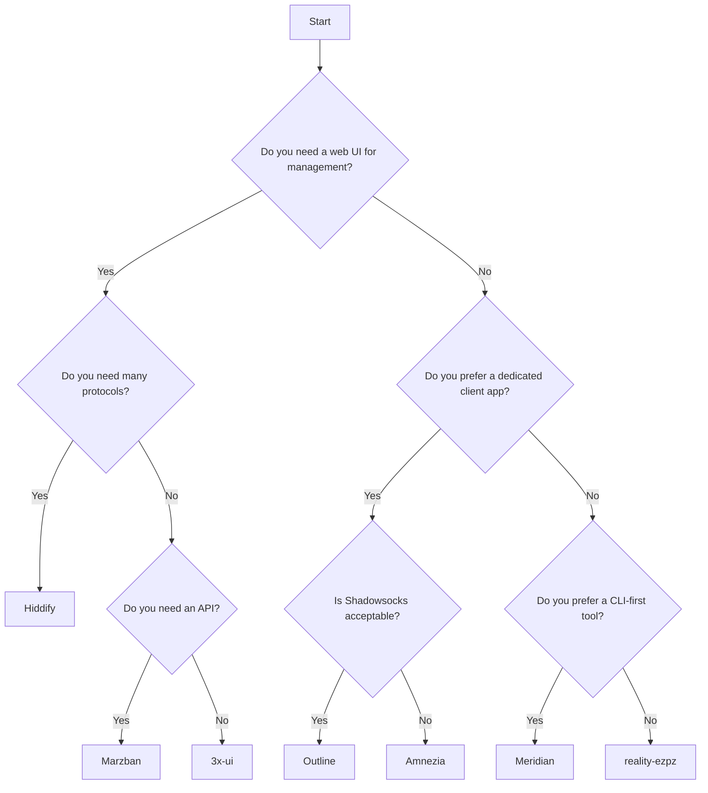
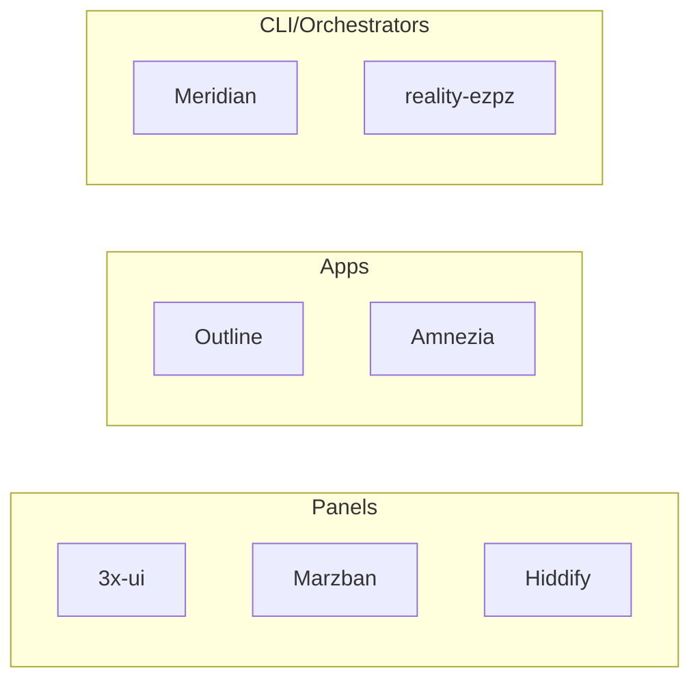

The world of self-hosted proxy tools has expanded significantly in recent years, driven by a growing need for private and unrestricted internet access. If you're looking to set up your own proxy server, the number of options can feel overwhelming. Broadly, they fall into three distinct categories: web-based **panels**, dedicated client **apps**, and command-line **orchestrators**. Each philosophy comes with its own set of trade-offs in terms of ease of use, flexibility, and security. This post offers an honest comparison of the major players in 2026 to help you decide which tool is the right fit for your needs.

## The panel approach: 3x-ui and Marzban

For many users, the most intuitive way to manage a server is through a graphical web interface. Panels like **3x-ui** and **Marzban** dominate this category. With over 32,500 stars on GitHub, 3x-ui is arguably the default choice for anyone wanting to manage an Xray-core server with a web UI. It provides granular control over users, allowing you to set traffic limits, expiration dates, and even restrict access by IP address. It’s a feature-rich tool that gives administrators a lot of power.

However, this power comes with significant security caveats. 3x-ui is notorious for its insecure default settings. Out of the box, it often exposes its management panel over unencrypted HTTP and can even display sensitive credentials in plain text. Hardening a 3x-ui installation is a manual process that requires a good deal of technical knowledge, and the project has a history of security vulnerabilities. While popular, it places a heavy burden on the user to secure their own setup.

Marzban, with 27,000 GitHub stars, is another major panel-based tool. It takes a more API-centric approach, making it a better fit for larger-scale deployments where automation is key. It is built on Docker, which can simplify installation for some. Yet, its power and flexibility come at the cost of a steep learning curve. Users frequently report that Marzban can be difficult to configure correctly. There are also persistent complaints about performance, with some users experiencing high ping times through the proxy, which can degrade the user experience for activities like video calling or gaming.

## The all-in-one manager: Hiddify

Positioning itself as a comprehensive solution, **Hiddify Manager** attempts to be everything for everyone. Its most prominent feature is its support for over 20 different proxy protocols, a staggering number that covers nearly every protocol in existence. The project is under active development and has a user interface that, while cluttered, shows a clear effort to be user-friendly. 

Unfortunately, this ambition to do everything comes with stability problems. Users often report frequent connection drops and a brittle installation process that can fail in non-standard environments. The sheer number of options in the interface can be overwhelming, leading to a confusing experience for less technical users. Hiddify is a powerful tool, but its attempt to be a universal solution often makes it a master of none, struggling with the reliability that is essential for a personal proxy.

## The app approach: Outline and Amnezia

In contrast to the complexity of panels, tools like **Outline** and **Amnezia** focus on providing a seamless user experience through dedicated client applications. Outline, backed by Google's Jigsaw, has what is widely considered the best user experience in the space. Its desktop and mobile apps are beautifully designed, and sharing access with others is incredibly simple. You send an invitation, they click a link, and the app configures itself. 

However, Outline has a fatal flaw: its sole reliance on the Shadowsocks protocol. While once effective, Shadowsocks is now easily detected and blocked by sophisticated censorship systems. Its predictable traffic patterns make it a liability in regions with heavily filtered networks. For users in those areas, Outline is unfortunately no longer a viable solution.

Amnezia VPN offers a more robust alternative. It supports multiple protocols, including its own custom protocol, **AmneziaWG**, which is designed for better detection resistance. Like Outline, it is managed through a desktop application, which some users may find convenient. The trade-off is that you are tied to their specific client, which may not be available on all platforms or may not be the preferred client for your users.

## The one-command scripts: reality-ezpz

At the other end of the spectrum from complex panels are simple, single-purpose installation scripts. Tools like **reality-ezpz** are philosophically the closest to Meridian. They aim to provide a zero-configuration setup of a modern, effective proxy protocol—in this case, VLESS+Reality. You run a single command, and you have a working proxy.

This simplicity, however, is also their main limitation. These scripts are rigid. If you have a web server already running on port 443, the script will fail. There is no built-in user management, no easy way to share connections with non-technical users, and no support for more advanced configurations like relays. Error handling is often minimal, leaving the user to debug shell scripts if something goes wrong. They are a great way to quickly set up a single-user proxy, but they lack the management and resilience features needed for sharing access with others.

## Where Meridian fits: the orchestrator approach

Meridian carves out a unique space for itself. It is not a panel, not a dedicated app, and not just a simple script. It is an **orchestrator**. A single `meridian deploy` command configures nginx and Xray into a hardened, production-ready stack — with UFW firewall, SSH hardening, and automatic TLS certificates included. It automates the complex process of tying these components together, a task that would otherwise require significant systems administration expertise. For more on this, see our post on [hardening a proxy server](/blog/02-proxy-server-hardening-2026/).

It is CLI-first by design, but it doesn't ignore the end-user experience. For sharing access, Meridian generates a secure, web-based connection page that provides one-click client configuration via QR codes and deep links. This hybrid approach gives the administrator the power and scriptability of a command-line tool while giving their users the simple experience of an app. This makes it ideal for the "tech friend" who manages access for their family and friends, a concept we explore in our [guide to sharing internet access](/blog/03-tech-friend-guide/).

## Security defaults compared

A critical differentiator between these tools is what they secure by default. A tool's default configuration reflects the developers' priorities and their respect for the user's security. Here is how the tools stack up in automatically configuring essential security measures.

| Feature | Meridian | 3x-ui | Marzban | Hiddify | Outline | reality-ezpz |
| :--- | :---: | :---: | :---: | :---: | :---: | :---: |
| **Firewall (UFW)** | ✅ | ❌ | ❌ | ✅ | ✅ | ❌ |
| **Auto TLS (Let's Encrypt)** | ✅ | ❌ | ✅ | ✅ | ✅ | ✅ |
| **SSH Hardening** | ✅ | ❌ | ❌ | ❌ | ❌ | ❌ |
| **BBR Congestion Control** | ✅ | ❌ | ❌ | ✅ | ❌ | ❌ |
| **Reverse Proxy** | ✅ | ❌ | ✅ | ✅ | ✅ | ❌ |

As the table shows, most tools leave critical hardening tasks to the user. Meridian and, to a lesser extent, Hiddify are the exceptions, aiming to provide a secure-by-default experience. This is a core part of Meridian's philosophy, which you can read more about in our [security documentation](https://getmeridian.org/docs/en/security).

## Honest gaps: what Meridian doesn't do

No tool is perfect for every situation, and an honest comparison requires acknowledging a tool's limitations. Meridian makes several intentional trade-offs.

First, it does not have a web UI for management. This is a deliberate design choice. A command-line interface is more easily scripted, audited, and has a significantly smaller attack surface than a complex web application. Second, Meridian does not have its own dedicated client app. It uses the rich ecosystem of existing V2Ray/Xray clients, which are available for every major platform. This avoids vendor lock-in and allows users to choose the client they prefer.

Third, Meridian focuses exclusively on the [VLESS+Reality protocol](/blog/01-why-vless-reality/). Rather than supporting dozens of protocols, we focus on making one highly effective and resilient protocol as robust as possible. Finally, Meridian is a newer project with a smaller community than the more established panels. This means fewer tutorials and community resources, though we are working hard to build this out with our comprehensive [documentation](https://getmeridian.org/docs/en/getting-started).

## Picking the right tool for your situation

Choosing the right self-hosted proxy tool depends entirely on your technical comfort level, your security needs, and who you are providing access for. 

If you want a graphical interface above all else and are comfortable with manual security hardening, **3x-ui** is a powerful option. If you need to manage a large number of users and require an API for automation, **Marzban** is worth the steep learning curve. If you want the simplest possible user experience and are in a region where Shadowsocks is not blocked, **Outline** is unmatched. Whichever tool you choose, picking the right server matters — see our guide on [choosing a VPS for a proxy](/blog/06-choosing-vps/).

If you are the designated "tech friend" for your circle and need a tool that is both powerful for you and simple for your users, we built **Meridian** for you. It automates the difficult parts of server administration while providing a seamless sharing experience, giving you a hardened, resilient proxy server with a single command. 

Ready to give it a try? Get started with our [installation guide](https://getmeridian.org/docs/en/getting-started).
