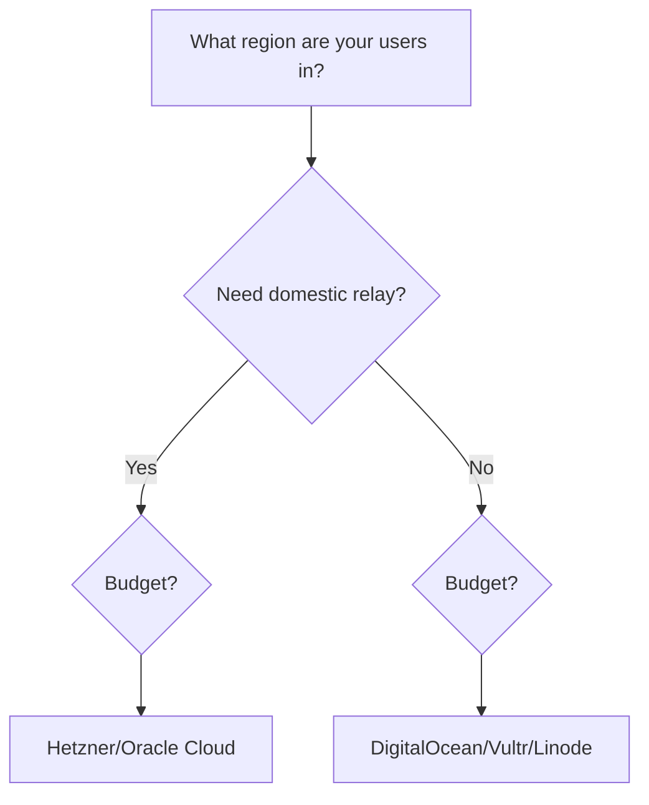
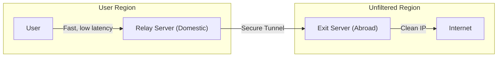

When you decide to run your own proxy server, the first decision you face is where to host it. The internet is flooded with offers for virtual private servers (VPS) for as little as five dollars a month. It is tempting to assume that cheaper is better, especially when the task of running a proxy does not seem to demand much in terms of raw computing power. This assumption, however, is a common pitfall that can lead to a frustrating experience and a poorly performing proxy.

The truth is that for a proxy server, the conventional metrics of server performance—CPU cores, RAM, and storage—are secondary. A proxy's effectiveness is not determined by its processing muscle but by the quality of its network connection. A five-dollar server with excellent network peering and a clean IP address will consistently outperform a twenty-dollar server on a congested, poorly connected network. The most important factors are the ones that VPS providers are often least transparent about: network quality, IP reputation, and peering arrangements.

## What actually matters: network quality, IP reputation, and peering

Let's break down the three pillars of a high-performing proxy server. First is **network quality**. This is not about the advertised bandwidth, but about consistency. It means low packet loss and stable latency. A connection with high packet loss will feel slow and unreliable, causing frequent disconnects and sluggish browsing, no matter how much bandwidth is available. Consistent latency, even if it is not the absolute lowest, is better than a connection that spikes unpredictably. Second is **IP reputation**. Every server has an IP address, and that IP address has a history. If the IP address was previously used for sending spam or other malicious activities, it might be on a blocklist. Many large services preemptively block entire IP ranges from known data centers that are popular for hosting proxies and VPNs. A server with a 'dirty' IP will find itself unable to connect to many common websites and services. Finally, there is **peering**. This refers to how a provider’s network connects to other networks, particularly the ones your users are on. Good peering to your target region means a more direct, less congested path for your traffic. A provider might have a massive pipe to the internet in general, but poor peering to a specific country's ISPs can result in slow speeds for users in that region.

## Location strategy: why server location matters more than specs

The physical location of your proxy server has a profound impact on its performance for your users. It is a common mistake to choose a server based on price or brand recognition alone, without considering geography. A server in Frankfurt serving users in Moscow will have a completely different performance profile than one located in Helsinki. The latency, or the time it takes for data to travel from the user to the server and back, is largely determined by the physical distance and the number of network hops between them. More importantly, the path the data takes is dictated by the peering relationships between the server's ISP and the user's ISP. A server that is geographically closer to your users' typical ISP peering points will almost always provide a faster and more reliable connection. This is why understanding where your users are and how their local internet infrastructure works is a critical first step in choosing a server location.

## The IP reputation problem: shared IPs and pre-blocked subnets

One of the most common frustrations when setting up a proxy is discovering that your brand new server is already blocked by the services you want to access. This is the IP reputation problem. Many low-cost VPS providers pack a large number of customers onto shared IP addresses. If one of those customers engages in abusive behavior, the entire IP can be blacklisted. Even with a dedicated IP, you might find yourself in a "bad neighborhood." Some providers, especially those popular for hosting proxies and VPNs, have entire IP ranges that are preemptively blocked by major content platforms and streaming services. These services know that traffic from these datacenter ranges is more likely to be from proxies, and they take a heavy-handed approach to blocking it.

This is not just a theoretical problem; it happens constantly. You might find that your proxy cannot access a specific streaming site, a gaming service, or even a simple news website. The only way to know for sure is to test. This is why Meridian includes a built-in preflight check. Before you commit to a full deployment, you can run a quick test to assess the server's connectivity and see if its IP address is already flagged by common services. It is a simple step that can save you hours of troubleshooting down the line.

## Providers that work well in practice

Choosing a provider can feel like a gamble, but some have a better track record than others for proxy hosting. This is not an advertisement, but a summary of what has worked well based on community experience. **Hetzner** is often praised for its excellent network peering in Europe and for providing clean IP addresses at a reasonable price. **DigitalOcean** is a reliable all-rounder with a good global footprint, making it a solid choice if your users are spread across different regions. For those on a tight budget or just looking to experiment, the **Oracle Cloud free tier** offers a surprisingly capable server at no cost, making it a great option for testing.

Other providers like **Vultr** and **Linode** (now part of Akamai) are also popular choices with extensive datacenter locations. It is important to remember that the quality of any provider can change over time. A provider with clean IPs today might have a reputation problem in six months as its service gets discovered and abused. The key is to stay flexible and be prepared to migrate if performance degrades. The community forums and discussion groups around self-hosted proxies are often the best source of up-to-date information on which providers are currently delivering the best performance.

## The relay strategy: domestic entry point + foreign exit server

For users in regions with aggressive internet filtering, even a well-chosen foreign server can be slow or unreliable. The connection might be unstable, or the latency might be too high for a good experience. In these cases, a more advanced setup known as a **relay strategy** can make a world of difference. This involves using two servers instead of one. The first server, the **relay**, is located in the same country as the user. This provides a fast, low-latency local connection. The relay server then forwards the traffic to the second server, the **exit server**, which is located in a country with unrestricted internet access. This exit server has the clean, foreign IP address that unblocks content.

This architecture splits the network path into two distinct legs. The first leg, from the user to the domestic relay, is fast and stable. The second leg, from the relay to the foreign exit, is handled by the high-quality networks of the datacenter providers. This setup can dramatically improve performance and reliability for users in challenging network environments. Meridian has built-in support for this relay architecture, making it easy to configure and deploy.

## Testing before committing: using Meridian's preflight and SNI scan

We have established that not all servers are created equal. To avoid wasting time and money on a server that is not up to the task, you should always test before you deploy. Meridian provides two powerful tools for this purpose. The `meridian preflight` command runs a series of checks on a fresh server to ensure it meets the requirements for a successful deployment. It checks for things like the operating system version, virtualization type, and whether the required ports are open. It also runs a quick connectivity test to major services to give you an early warning about potential IP reputation issues.

For users of the Reality protocol, the `meridian scan` command is an essential tool. It probes a list of popular websites to find the best **SNI (Server Name Indication)** targets for your server's location. A good SNI target is a website that is not blocked in your target region and has a fast, reliable connection from your server. Running these checks before you deploy can help you avoid common pitfalls and ensure that your proxy works as expected from the very beginning.

## When to rebuild: recognizing IP blocks and the fast migration workflow

No matter how carefully you choose your server, there is always a chance that its IP address will eventually get blocked. It is an unavoidable reality of running a proxy. The key is not to prevent blocks altogether, but to be able to recover from them quickly. When you notice that your proxy is no longer able to connect to certain sites, or when your users report that their connections are failing, it is likely that the IP has been blocked.

This is where Meridian’s fast migration workflow comes in. Instead of trying to debug the old server, the most efficient solution is to simply get a new one. You can spin up a new VPS with a different provider in minutes. Then, you run a single command: `meridian deploy NEW_IP`. Meridian will deploy a fresh instance of your proxy on the new server. After the deployment completes, you will need to re-add your clients using `meridian client add <name>` and share the new connection pages with your users. While this does require a few extra steps, the entire process—from recognizing a block to being back online with a new IP and redistributing access—can be completed in under fifteen minutes.

For more details on getting started, deploying your first server, or setting up a relay, check out the [Meridian documentation](https://getmeridian.org/docs/en/getting-started). You can also read our guides on [sharing access with your tech-averse friends](/blog/03-tech-friend-guide/) and the [deep-dive into Meridian's architecture](/blog/04-meridian-architecture/).
