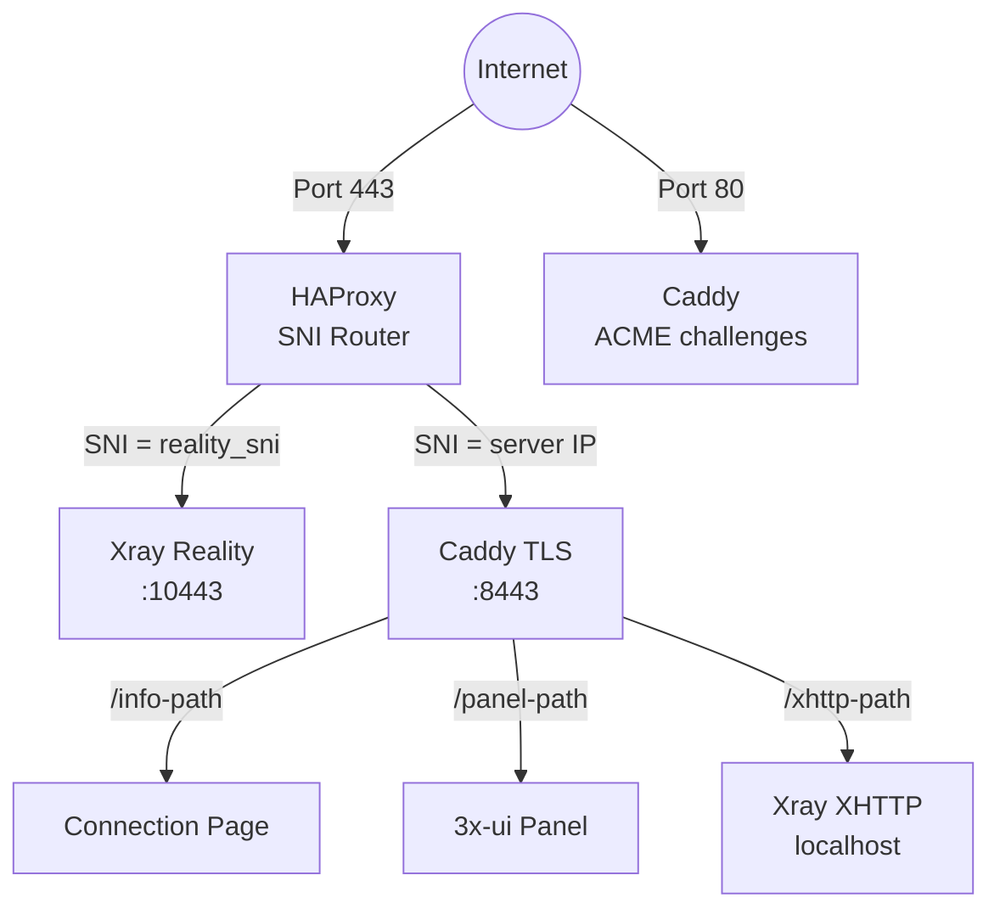
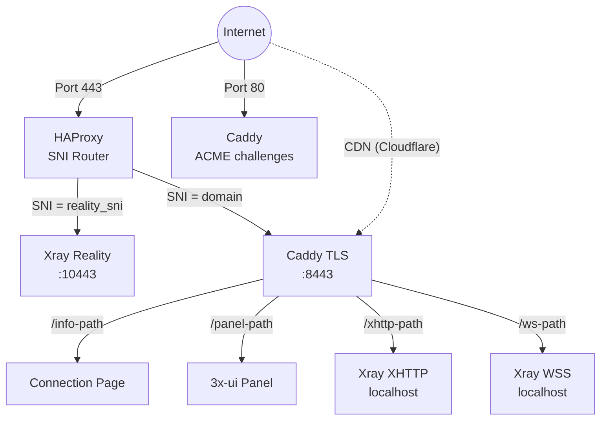

## Service topology

### Standalone mode (no domain)

HAProxy does **not** terminate TLS. It reads the SNI hostname from the TLS Client Hello and forwards the raw TCP stream to the appropriate backend.

Caddy requests a Let's Encrypt IP certificate via the ACME `shortlived` profile (6-day validity, auto-renewed). Falls back to self-signed if IP cert issuance is not supported.

XHTTP runs on a localhost-only port and is reverse-proxied by Caddy — no extra external port exposed.

### Domain mode

Domain mode adds VLESS+WSS as a CDN fallback path. Traffic flows through Cloudflare's CDN via WebSocket, making the connection work even if the server's IP is blocked.

### Relay topology

A relay node is a lightweight TCP forwarder running [Realm](https://github.com/zhboner/realm). The client connects to the relay's domestic IP, which forwards raw TCP to the exit server abroad. All encryption is end-to-end between client and exit — the relay never sees plaintext.

## How Reality protocol works

1. Server generates an **x25519 keypair**. Public key is shared with clients, private key stays on server.
2. Client connects on port 443 with a TLS Client Hello containing the camouflage domain (e.g., `www.microsoft.com`) as SNI.
3. To any observer, this looks like a normal HTTPS connection to microsoft.com.
4. If a **prober** sends their own Client Hello, the server proxies the connection to the real microsoft.com — the prober sees a valid certificate.
5. If the client includes valid authentication (derived from the x25519 key), the server establishes the VLESS tunnel.
6. **uTLS** makes the Client Hello byte-for-byte identical to Chrome's, defeating TLS fingerprinting.

## Port assignments

| Port | Service | Mode |
|------|---------|------|
| 443 | HAProxy (SNI router) | All |
| 80 | Caddy (ACME challenges) | All |
| 10443 | Xray Reality (internal) | All |
| 8443 | Caddy TLS (internal) | All |
| localhost | Xray XHTTP | When XHTTP enabled |
| localhost | Xray WSS | Domain mode |
| 2053 | 3x-ui panel (internal) | All |

XHTTP and WSS ports are localhost-only — Caddy reverse-proxies to them on port 443.

## Provisioning pipeline

| # | Step | Purpose |
|---|------|---------|
| 1 | InstallPackages | OS packages |
| 2 | EnableAutoUpgrades | Unattended upgrades |
| 3 | SetTimezone | UTC |
| 4 | HardenSSH | Key-only auth |
| 5 | ConfigureBBR | TCP congestion control |
| 6 | ConfigureFirewall | UFW: 22 + 80 + 443 |
| 7 | InstallDocker | Docker CE |
| 8 | Deploy3xui | 3x-ui container |
| 9 | ConfigurePanel | Panel credentials |
| 10 | LoginToPanel | API auth |
| 11 | CreateRealityInbound | VLESS+Reality |
| 12 | CreateXHTTPInbound | VLESS+XHTTP |
| 13 | CreateWSSInbound | VLESS+WSS (domain) |
| 14 | VerifyXray | Health check |
| 15 | InstallHAProxy | SNI routing |
| 16 | InstallCaddy | TLS + reverse proxy |
| 17 | DeployConnectionPage | QR codes + page |

## Credential lifecycle

1. **Generate**: random credentials (panel password, x25519 keys, client UUID)
2. **Save locally**: `~/.meridian/credentials/<IP>/proxy.yml` — saved BEFORE applying to server
3. **Apply**: panel password changed, inbounds created
4. **Sync**: credentials copied to `/etc/meridian/proxy.yml` on server
5. **Re-runs**: loaded from cache, not regenerated (idempotent)
6. **Cross-machine**: `meridian server add IP` fetches from server via SSH
7. **Uninstall**: deleted from both server and local machine
