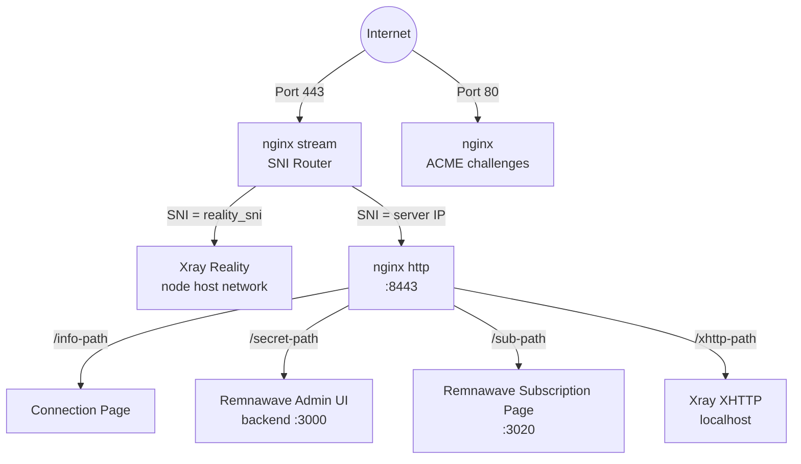
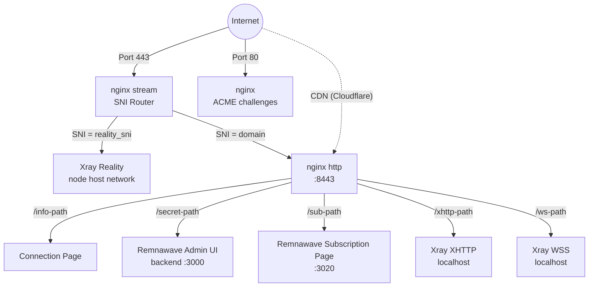

## Technology stack

- **VLESS+Reality** (Xray-core) — proxy protocol that impersonates a legitimate TLS website. Censors probing the server see a real certificate (e.g., from microsoft.com). Only clients with the correct private key can connect.
- **Remnawave** — modern panel stack for Xray, deployed as separate `remnawave/backend`, `remnawave/node`, and `remnawave/subscription-page` Docker containers. Backend exposes a REST API (managed via the official `remnawave` Python SDK); node runs Xray in `network_mode: host`; subscription-page serves per-user config URLs.
- **nginx** — single-process web server handling both SNI routing and TLS. The stream module listens on port 443 and routes traffic by SNI hostname without terminating TLS. The http module on port 8443 terminates TLS, serves connection pages, reverse-proxies the Remnawave admin UI + subscription page, and proxies XHTTP/WSS traffic to Xray. Certificates are managed by [acme.sh](https://github.com/acmesh-official/acme.sh) (Let's Encrypt).
- **Docker** — runs Remnawave backend + PostgreSQL + Valkey (panel host only), Remnawave node (every exit node), and Remnawave subscription-page (panel host, optional).
- **Pure-Python provisioner** — `src/meridian/provision/` executes deployment steps via SSH. Each step gets `(conn, ctx)` and returns a `StepResult`.
- **uTLS** — impersonates Chrome's TLS Client Hello fingerprint, making connections indistinguishable from real browser traffic.

## Service topology

### Standalone mode (no domain)

nginx stream **does not** terminate TLS. It reads the SNI hostname from the TLS Client Hello and forwards the raw TCP stream to the appropriate backend.

acme.sh requests a Let's Encrypt IP certificate (6-day shortlived profile, auto-renewed). Falls back to self-signed if IP cert issuance is not supported.

XHTTP runs on a localhost-only port and is reverse-proxied by nginx — no extra external port exposed.

### Domain mode

Domain mode adds VLESS+WSS as a CDN fallback path. Traffic flows through Cloudflare's CDN via WebSocket, making the connection work even if the server's IP is blocked.

### Relay topology

A relay node is a lightweight TCP forwarder running [Realm](https://github.com/zhboner/realm). The client connects to the relay's domestic IP, which forwards raw TCP to the exit server abroad. All encryption is end-to-end between client and exit — the relay never sees plaintext.

## How Reality protocol works

1. Server generates an **x25519 keypair**. Public key is shared with clients, private key stays on server.
2. Client connects on port 443 with a TLS Client Hello containing the camouflage domain (e.g., `www.microsoft.com`) as SNI.
3. To any observer, this looks like a normal HTTPS connection to microsoft.com.
4. If a **prober** sends their own Client Hello, the server proxies the connection to the real microsoft.com — the prober sees a valid certificate.
5. If the client includes valid authentication (derived from the x25519 key), the server establishes the VLESS tunnel.
6. **uTLS** makes the Client Hello byte-for-byte identical to Chrome's, defeating TLS fingerprinting.

## Declarative state model

Meridian stores every fleet detail in a single `cluster.yml` at `~/.meridian/cluster.yml`:

- **Actual state** — `panel` (URL, API token, admin creds, secret_path, sub_path), `nodes[]`, `relays[]`, `inbounds{}`, `branding` — populated by `meridian deploy`, `meridian node add`, etc. Users generally do not edit these by hand.
- **Desired state** — `desired_nodes[]`, `desired_relays[]`, `desired_clients[]`, `subscription_page` — optionally written by the operator. `meridian plan` shows a Terraform-style diff between desired and actual; `meridian apply` converges.

Remnawave's own state (users, hosts, config profile, internal squads) lives in its PostgreSQL database on the panel host. Meridian reads and writes that state through the official REST API using the pinned `remnawave` Python SDK. The panel database is the source of truth for clients; `cluster.yml` is the source of truth for fleet topology.

## Docker container layout

**On the panel host** (the first `meridian deploy` target):
- `remnawave` (backend) — NestJS API on `127.0.0.1:3000`, reverse-proxied at `/<panel.secret_path>/`
- `remnawave-db` — PostgreSQL storing users, hosts, inbounds
- `remnawave-redis` — Valkey cache (Redis-compatible fork; container keeps the legacy `redis` name for client-library compatibility)
- `remnawave-subscription-page` — subscription frontend, container-internal port 3010, remapped to `127.0.0.1:3020` on the host to avoid colliding with the node API on the same machine; reverse-proxied at `/<subscription_page.path>/`
- `remnawave-node` — Xray runner in `network_mode: host` with `cap_add: NET_ADMIN` (required by panel 2.6.2+ for plugins and IP Control)

**On non-panel nodes** (every `meridian node add` target):
- `remnawave-node` only — registered against the panel's API via a per-node secret key

All panel + subscription images are pinned in `src/meridian/config.py` and kept in lockstep with the SDK.

## Panel API surface used by Meridian

Meridian talks to Remnawave mostly through the official SDK (`remnawave` v2.7.1). A few bootstrap and fallback paths — initial admin registration, API-token creation, and endpoints not yet covered by the SDK — use raw `httpx` against the panel URL. Surfaces used:

- **Users** — `create_user`, `get_user`, `delete_user`, `list_users`, `enable_user`, `disable_user` (client CRUD)
- **Hosts** — `create_host`, `list_hosts`, `enable_host`, `disable_host`, `delete_host` (per-inbound endpoints shown in subscription URLs)
- **Nodes** — `create_node`, `list_nodes`, `disable_node`, `delete_node`, `update_node_name`, plus the node secret / mTLS keygen bundle
- **Inbounds** — `list_inbounds`, `assign_inbounds_to_squad` (inbound ↔ squad wiring)
- **Config profiles** — `create_config_profile`, `get_config_profile`, `update_xray_config` (available; used by future split-routing feature)
- **Internal squads** — `list_internal_squads` (users grouped for host visibility)

Reality x25519 keypairs are NOT fetched from the panel — Meridian generates them server-side on the node using the xray binary (`xray x25519`) and persists them in `cluster.yml` so they survive redeploy.

Admin UI is reverse-proxied by nginx at `/<panel.secret_path>/` on port 443 in all modes — no SSH tunnel needed.

## Drift and plan / apply

Whenever an admin edits state directly in the Remnawave UI (e.g. adds a user, renames a host), the next `meridian plan` reads actual state from the panel, compares it against desired state (`cluster.yml`), and emits the diff as typed `PlanAction` objects. `meridian apply` executes them, calling the same SDK surfaces.

`meridian apply` snapshots desired state into `cluster._extra["desired_*_applied"]` after every successful run. The next plan uses that snapshot to distinguish intentional removals (was in last-applied) from drift (was never applied). This mirrors Terraform's state-tracking behaviour.

## nginx configuration pattern

Meridian writes to `/etc/nginx/conf.d/meridian-stream.conf` and `/etc/nginx/conf.d/meridian-http.conf` (never the main `nginx.conf`). This allows Meridian to coexist with user's own nginx configuration.

nginx handles:
- SNI routing on port 443 (stream module, no TLS termination)
- TLS termination on port 8443 (http module, certificates managed by acme.sh)
- Reverse proxy for the Remnawave admin UI (`/<panel.secret_path>/` → `127.0.0.1:3000`)
- Reverse proxy for the Remnawave subscription page (`/<subscription_page.path>/` → `127.0.0.1:3020`)
- Connection info page serving (hosted pages with shareable URLs)
- Reverse proxy for XHTTP traffic to Xray (path-based routing, all modes when XHTTP enabled)
- Reverse proxy for WSS traffic to Xray (domain mode only)

## Port assignments

| Port | Service | Scope |
|------|---------|-------|
| 443 | nginx stream (SNI router) | Public |
| 80 | nginx (ACME challenges) | Public |
| 8443 | nginx http (internal terminus) | Internal |
| 3000 | Remnawave backend (admin UI + API) | localhost |
| 3010 | Remnawave node API | host network |
| 3020 | Remnawave subscription page | localhost |
| 10000-10999 | Xray Reality (per-node deterministic) | host network |
| 20000-29999 | Xray WSS (domain mode, per-node) | host network |
| 30000-39999 | Xray XHTTP (per-node deterministic) | host network |
| 5432 | PostgreSQL (Remnawave DB) | internal Docker network |

XHTTP, WSS, and Reality ports on the node host are opened on the host network because the node container uses `network_mode: host`. Meridian's UFW profile blocks them from the public internet; nginx reverse-proxies as needed.

## Provisioning pipeline

Steps execute sequentially via `build_setup_steps()` (panel host) or `build_node_steps()` (node-only, used for redeploys and `meridian node add`). Each step gets `(conn, ctx)` and returns a `StepResult`.

| # | Step | Module | Purpose |
|---|------|--------|---------|
| 1 | CheckDiskSpace | `common.py` | Preflight |
| 2 | InstallPackages | `common.py` | OS packages (+fail2ban when hardening) |
| 3 | EnableAutoUpgrades | `common.py` | Unattended upgrades |
| 4 | SetTimezone | `common.py` | UTC |
| 5 | HardenSSH | `common.py` | Key-only auth (when hardening) |
| 6 | ConfigureFail2ban | `common.py` | sshd brute-force jail (when hardening) |
| 7 | ConfigureBBR | `common.py` | TCP congestion control |
| 8 | ConfigureFirewall | `common.py` | UFW: 22 + 80 + 443 (when hardening) |
| 9 | InstallDocker | `docker.py` | Docker CE |
| 10 | CleanupLegacyPanel | `legacy_cleanup.py` | Remove old 3x-ui if upgrading from v3 |
| 11 | DeployRemnawavePanel | `remnawave_panel.py` | Backend + PostgreSQL + Valkey + subscription-page |
| 12 | InstallWarp | `warp.py` | Cloudflare WARP (optional) |
| 13 | InstallNginx | `nginx.py` | SNI routing + TLS + reverse proxy |
| 14 | ConfigureNginx | `nginx.py` | nginx config for IP or domain mode |
| 15 | IssueTLSCert | `tls.py` | acme.sh + Let's Encrypt |
| 16 | DeployPWAAssets | `services.py` | PWA connection page assets |

After the provisioner pipeline, `_configure_panel_and_node` in `setup.py` uses the Remnawave REST API to register inbounds, create the node container, assign hosts, and create the default client. The node container is NOT part of the SSH pipeline because it requires a panel-issued secret key.

## Parallel provisioning

`meridian apply` can provision independent nodes concurrently via `ThreadPoolExecutor` (`--parallel N`, default 4). Each worker gets its own `MeridianPanel` SDK instance; the underlying httpx client and the per-thread asyncio event loop are isolated via `threading.local()`. `cluster.save()` is protected by an `RLock` so parallel snapshots serialize cleanly.

## Credential lifecycle

1. **Generate**: random credentials (panel password, JWT secrets, PostgreSQL password, node secret key, Reality x25519 keypair per node, client UUIDs)
2. **Save locally**: `~/.meridian/cluster.yml` — saved immediately before API/SSH operations so a crashed deploy can resume
3. **Apply**: panel + node containers brought up, inbounds and hosts created via REST API
4. **Sync**: Remnawave panel database (Postgres) and `cluster.yml` both hold the canonical state; drift is reported by `meridian plan`
5. **Re-runs**: Reality keys and client UUIDs are preserved across redeploys (the panel refuses to regenerate when they exist)
6. **Recovery**: `meridian fleet recover <IP>` rebuilds `cluster.yml` from the live panel API when the local copy is lost
7. **Uninstall**: `meridian teardown <IP>` stops and removes all Remnawave containers, nginx config, and local `cluster.yml` panel entry (optionally the whole file)

## File locations

### On the panel host
- `/opt/remnawave/` — panel compose file + `.env` + subscription page `.env`
- `/opt/remnawave/data/` — PostgreSQL data volume
- `/etc/nginx/conf.d/meridian-stream.conf` — nginx stream config (SNI routing)
- `/etc/nginx/conf.d/meridian-http.conf` — nginx http config (TLS, reverse proxy)
- `/etc/ssl/meridian/` — TLS certificates (managed by acme.sh)

### On each node
- `/opt/remnanode/` — node compose file + `.env`

### On the local (deployer) machine
- `~/.meridian/cluster.yml` — fleet state (panel creds, nodes, relays, desired state)
- `~/.meridian/cluster.yml.bak` — automatic backup before destructive operations
- `~/.meridian/cache/` — update check throttle cache
- `~/.local/bin/meridian` — CLI entry point (installed via uv/pipx)

Legacy files (`~/.meridian/credentials/`, `~/.meridian/servers`) persist only for upgrade migration from Meridian 3.x.
