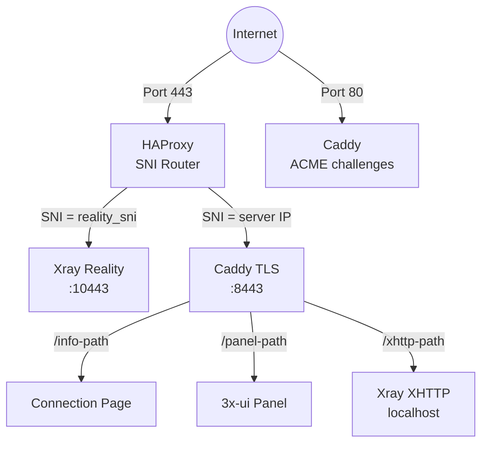
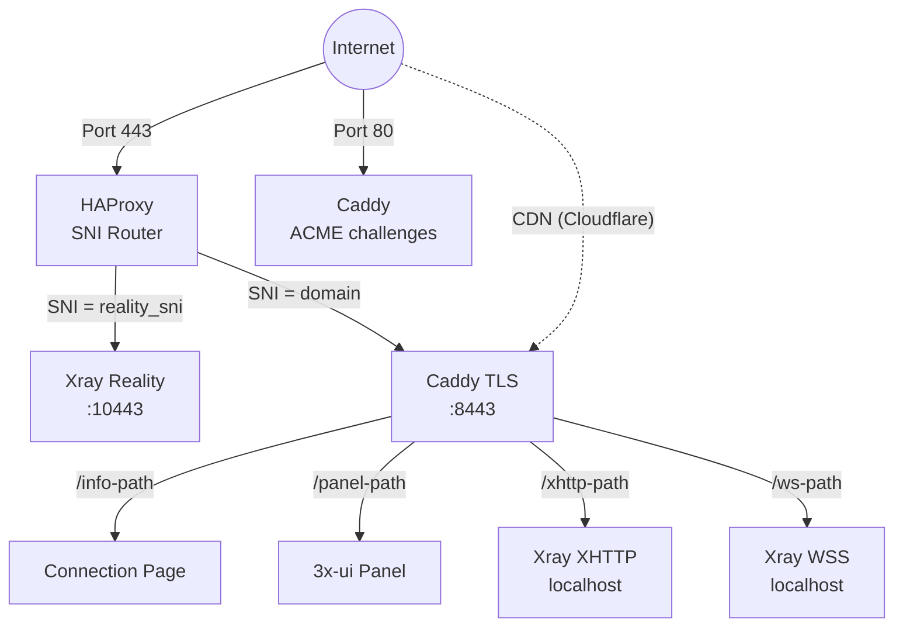
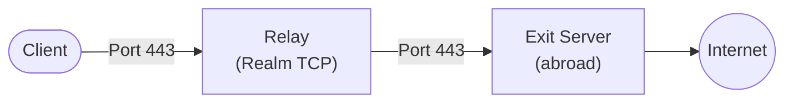

## Technology stack

- **VLESS+Reality** (Xray-core) — proxy protocol that impersonates a legitimate TLS website. Censors probing the server see a real certificate (e.g., from microsoft.com). Only clients with the correct private key can connect.
- **3x-ui** — web panel for managing Xray, deployed as a Docker container. Meridian controls it entirely via REST API.
- **HAProxy** — TCP-level SNI router on port 443. Routes traffic by SNI hostname without terminating TLS.
- **Caddy** — reverse proxy with automatic TLS. In standalone mode, requests a Let's Encrypt IP certificate via ACME `shortlived` profile (6-day validity). Serves connection pages, reverse-proxies the panel, and proxies XHTTP/WSS traffic to Xray.
- **Docker** — runs 3x-ui (which contains Xray). All proxy traffic flows through the container.
- **Pure-Python provisioner** — `src/meridian/provision/` executes deployment steps via SSH. Each step gets `(conn, ctx)` and returns a `StepResult`.
- **uTLS** — impersonates Chrome's TLS Client Hello fingerprint, making connections indistinguishable from real browser traffic.

## Service topology

### Standalone mode (no domain)

HAProxy does **not** terminate TLS. It reads the SNI hostname from the TLS Client Hello and forwards the raw TCP stream to the appropriate backend.

Caddy requests a Let's Encrypt IP certificate via the ACME `shortlived` profile (6-day validity, auto-renewed). Falls back to self-signed if IP cert issuance is not supported.

XHTTP runs on a localhost-only port and is reverse-proxied by Caddy — no extra external port exposed.

### Domain mode

Domain mode adds VLESS+WSS as a CDN fallback path. Traffic flows through Cloudflare's CDN via WebSocket, making the connection work even if the server's IP is blocked.

### Relay topology

A relay node is a lightweight TCP forwarder running [Realm](https://github.com/zhboner/realm). The client connects to the relay's domestic IP, which forwards raw TCP to the exit server abroad. All encryption is end-to-end between client and exit — the relay never sees plaintext.

## How Reality protocol works

1. Server generates an **x25519 keypair**. Public key is shared with clients, private key stays on server.
2. Client connects on port 443 with a TLS Client Hello containing the camouflage domain (e.g., `www.microsoft.com`) as SNI.
3. To any observer, this looks like a normal HTTPS connection to microsoft.com.
4. If a **prober** sends their own Client Hello, the server proxies the connection to the real microsoft.com — the prober sees a valid certificate.
5. If the client includes valid authentication (derived from the x25519 key), the server establishes the VLESS tunnel.
6. **uTLS** makes the Client Hello byte-for-byte identical to Chrome's, defeating TLS fingerprinting.

## Docker container structure

The `3x-ui` Docker container contains:
- **3x-ui web panel** — REST API on port 2053 (internal)
- **Xray binary** at `/app/bin/xray-linux-*` (architecture-dependent path)
- **Database** at `/etc/x-ui/x-ui.db` (SQLite, stores inbound configs and clients)
- **Xray config** managed by 3x-ui (not a static file)

Meridian manages 3x-ui entirely via its REST API:
- `POST /login` — authenticate (form-urlencoded, returns session cookie)
- `POST /panel/api/inbounds/add` — create VLESS inbound
- `GET /panel/api/inbounds/list` — list inbounds (check before creating)
- `POST /panel/setting/update` — configure panel settings
- `POST /panel/setting/updateUser` — change panel credentials

## Caddy configuration pattern

Meridian writes to `/etc/caddy/conf.d/meridian.caddy` (never the main Caddyfile). The main Caddyfile gets a single line added: `import /etc/caddy/conf.d/*.caddy`. This allows Meridian to coexist with user's own Caddy configuration.

Caddy handles:
- Auto-TLS certificate (domain cert or Let's Encrypt IP cert via ACME `shortlived` profile)
- Reverse proxy for the 3x-ui panel (at a random web base path)
- Connection info page serving (hosted pages with shareable URLs)
- Reverse proxy for XHTTP traffic to Xray (path-based routing, all modes when XHTTP enabled)
- Reverse proxy for WSS traffic to Xray (domain mode only)

## Port assignments

| Port | Service | Mode |
|------|---------|------|
| 443 | HAProxy (SNI router) | All |
| 80 | Caddy (ACME challenges) | All |
| 10443 | Xray Reality (internal) | All |
| 8443 | Caddy TLS (internal) | All |
| localhost | Xray XHTTP | When XHTTP enabled |
| localhost | Xray WSS | Domain mode |
| 2053 | 3x-ui panel (internal) | All |

XHTTP and WSS ports are localhost-only — Caddy reverse-proxies to them on port 443.

## Provisioning pipeline

Steps execute sequentially via `build_setup_steps()`. Each step gets `(conn, ctx)` and returns a `StepResult`.

| # | Step | Module | Purpose |
|---|------|--------|---------|
| 1 | InstallPackages | `common.py` | OS packages |
| 2 | EnableAutoUpgrades | `common.py` | Unattended upgrades |
| 3 | SetTimezone | `common.py` | UTC |
| 4 | HardenSSH | `common.py` | Key-only auth |
| 5 | ConfigureBBR | `common.py` | TCP congestion control |
| 6 | ConfigureFirewall | `common.py` | UFW: 22 + 80 + 443 |
| 7 | InstallDocker | `docker.py` | Docker CE |
| 8 | Deploy3xui | `docker.py` | 3x-ui container |
| 9 | ConfigurePanel | `panel.py` | Panel credentials |
| 10 | LoginToPanel | `panel.py` | API auth |
| 11 | CreateRealityInbound | `xray.py` | VLESS+Reality |
| 12 | CreateXHTTPInbound | `xray.py` | VLESS+XHTTP |
| 13 | CreateWSSInbound | `xray.py` | VLESS+WSS (domain) |
| 14 | VerifyXray | `xray.py` | Health check |
| 15 | InstallHAProxy | `services.py` | SNI routing |
| 16 | InstallCaddy | `services.py` | TLS + reverse proxy |
| 17 | DeployConnectionPage | `services.py` | QR codes + page |

## Credential lifecycle

1. **Generate**: random credentials (panel password, x25519 keys, client UUID)
2. **Save locally**: `~/.meridian/credentials/<IP>/proxy.yml` — saved BEFORE applying to server
3. **Apply**: panel password changed, inbounds created
4. **Sync**: credentials copied to `/etc/meridian/proxy.yml` on server
5. **Re-runs**: loaded from cache, not regenerated (idempotent)
6. **Cross-machine**: `meridian server add IP` fetches from server via SSH
7. **Uninstall**: deleted from both server and local machine

## File locations

### On the server
- `/etc/meridian/proxy.yml` — credentials and client list
- `/etc/caddy/conf.d/meridian.caddy` — Caddy config
- `/etc/haproxy/haproxy.cfg` — HAProxy config
- Docker container `3x-ui` — Xray + panel

### On the local machine
- `~/.meridian/credentials/<IP>/` — cached credentials per server
- `~/.meridian/servers` — server registry
- `~/.meridian/cache/` — update check throttle cache
- `~/.local/bin/meridian` — CLI entry point (installed via uv/pipx)
