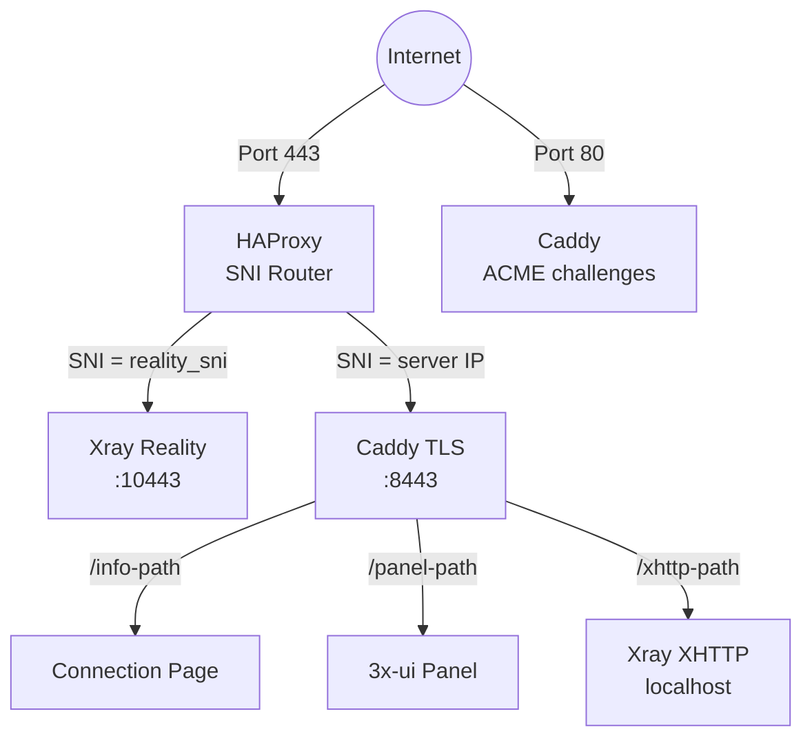
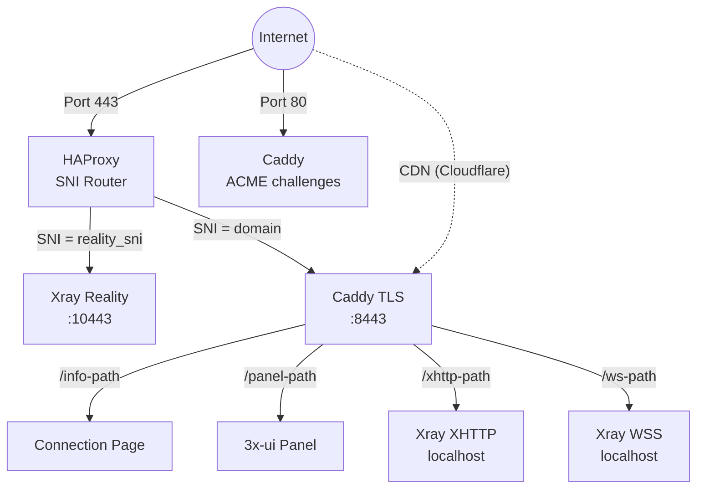
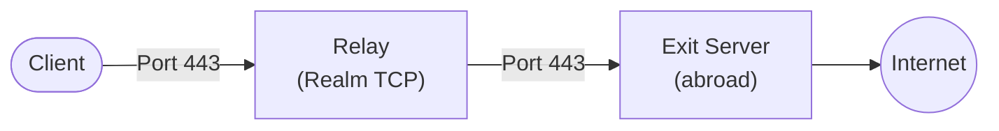

## توپولوژی سرویس

### حالت Standalone (بدون دامنه)

HAProxy TLS را تعریف نمی‌کند. آن SNI hostname را از TLS Client Hello می‌خواند و جریان TCP خام را به backend مناسب منتقل می‌کند.

Caddy گواهینامه IP Let's Encrypt را از طریق پروفایل ACME `shortlived` درخواست می‌کند (اعتبار 6 روز، تمدید خودکار). اگر صدور گواهینامه IP پشتیبانی نشود، به self-signed بازمی‌گردد.

XHTTP روی یک پورت localhost-only اجرا می‌شود و توسط Caddy reverse-proxy می‌شود — هیچ پورت خارجی اضافی노출نمی‌شود.

### حالت Domain

حالت دامنه VLESS+WSS را به عنوان مسیر fallback CDN اضافه می‌کند. ترافیک از طریق CDN Cloudflare با WebSocket جریان می‌یابد، که اتصال حتی اگر IP سرور مسدود شود کار می‌کند.

### توپولوژی Relay

Relay یک دستگاه ارسال TCP سطح ۴ است که ترافیک خام را از کلاینت به سرور خروجی منتقل می‌کند. تمامی رمزگذاری بین کلاینت و سرور خروجی انجام می‌شود، relay هرگز plaintext را نمی‌بیند. این معماری امکان استفاده از نقاط ورودی داخلی (عادی‌تر، کمتر محدود) را فراهم می‌کند و سرور خروجی را در خارج از کشور قرار می‌دهد.

## نحوه کار پروتکل Reality

1. سرور یک **keypair x25519** تولید می‌کند. کلید عمومی با کلاینت‌ها به اشتراک گذاشته می‌شود، کلید خصوصی روی سرور می‌ماند.
2. کلاینت روی پورت 443 اتصال برقرار می‌کند با TLS Client Hello که شامل دامنه تقلبی (مثلاً `www.microsoft.com`) به عنوان SNI است.
3. برای هر ناظر، این به نظر می‌رسد یک اتصال معمولی HTTPS به microsoft.com.
4. اگر یک **prober** Client Hello خود را ارسال کند، سرور اتصال را به microsoft.com واقعی proxy می‌کند — prober یک گواهینامه معتبر می‌بیند.
5. اگر کلاینت تأیید معتبر (مشتق شده از کلید x25519) را شامل شود، سرور تونل VLESS را برقرار می‌کند.
6. **uTLS** Client Hello را بایت برای بایت یکسان با Chrome می‌سازد، شکست TLS fingerprinting را شکست می‌دهد.

## اختصاص پورت

| پورت | سرویس | حالت |
|------|---------|------|
| 443 | HAProxy (SNI router) | همه |
| 80 | Caddy (ACME challenges) | همه |
| 10443 | Xray Reality (internal) | همه |
| 8443 | Caddy TLS (internal) | همه |
| localhost | Xray XHTTP | هنگام فعال بودن XHTTP |
| localhost | Xray WSS | حالت دامنه |
| 2053 | 3x-ui panel (internal) | همه |

پورت‌های XHTTP و WSS فقط localhost هستند — Caddy reverse-proxy آن‌ها را روی پورت 443 انجام می‌دهد.

## خط لوله Provisioning

| # | مرحله | هدف |
|---|------|---------|
| 1 | InstallPackages | بسته‌های OS |
| 2 | EnableAutoUpgrades | ارتقاهای بدون نظارت |
| 3 | SetTimezone | UTC |
| 4 | HardenSSH | احراز هویت فقط کلید |
| 5 | ConfigureBBR | کنترل ازدحام TCP |
| 6 | ConfigureFirewall | UFW: 22 + 80 + 443 |
| 7 | InstallDocker | Docker CE |
| 8 | Deploy3xui | container 3x-ui |
| 9 | ConfigurePanel | اعتبارات پنل |
| 10 | LoginToPanel | احراز هویت API |
| 11 | CreateRealityInbound | VLESS+Reality |
| 12 | CreateXHTTPInbound | VLESS+XHTTP |
| 13 | CreateWSSInbound | VLESS+WSS (domain) |
| 14 | VerifyXray | بررسی سلامت |
| 15 | InstallHAProxy | مسیریابی SNI |
| 16 | InstallCaddy | TLS + reverse proxy |
| 17 | DeployConnectionPage | QR codes + page |

## چرخه حیات اعتبارات

1. **تولید**: اعتبارات تصادفی (رمز پنل، کلیدهای x25519، UUID کلاینت)
2. **ذخیره محلی**: `~/.meridian/credentials/<IP>/proxy.yml` — قبل از اعمال روی سرور ذخیره می‌شود
3. **اعمال**: رمز پنل تغییر می‌کند، inbounds ایجاد می‌شوند
4. **هماهنگی**: اعتبارات به `/etc/meridian/proxy.yml` روی سرور کپی می‌شوند
5. **بازاجرا**: از cache بارگذاری می‌شوند، دوباره تولید نمی‌شوند (idempotent)
6. **ماشین‌های متعدد**: `meridian server add IP` از سرور از طریق SSH واکشی می‌کند
7. **حذف**: از سرور و ماشین محلی حذف می‌شوند
