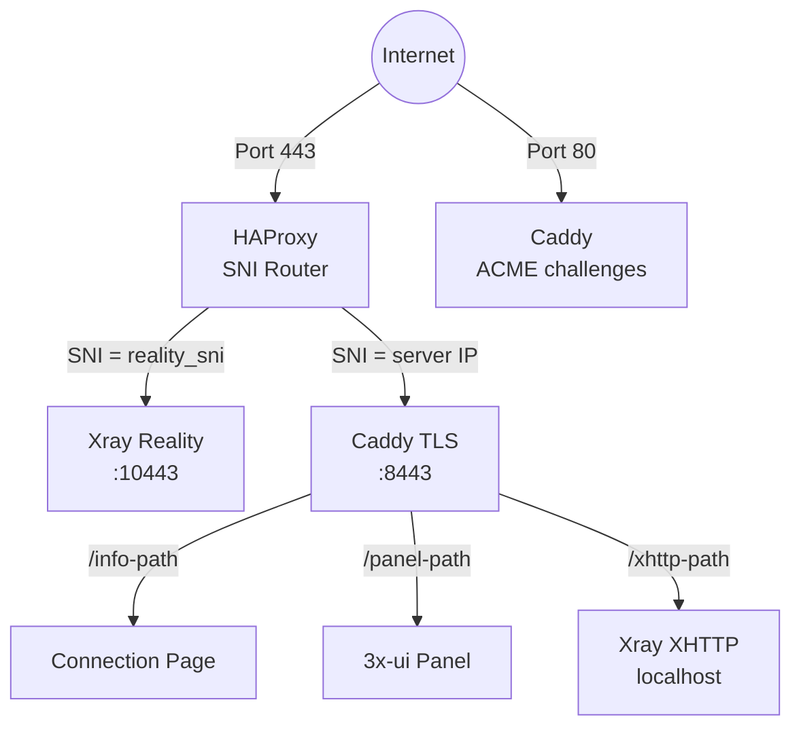
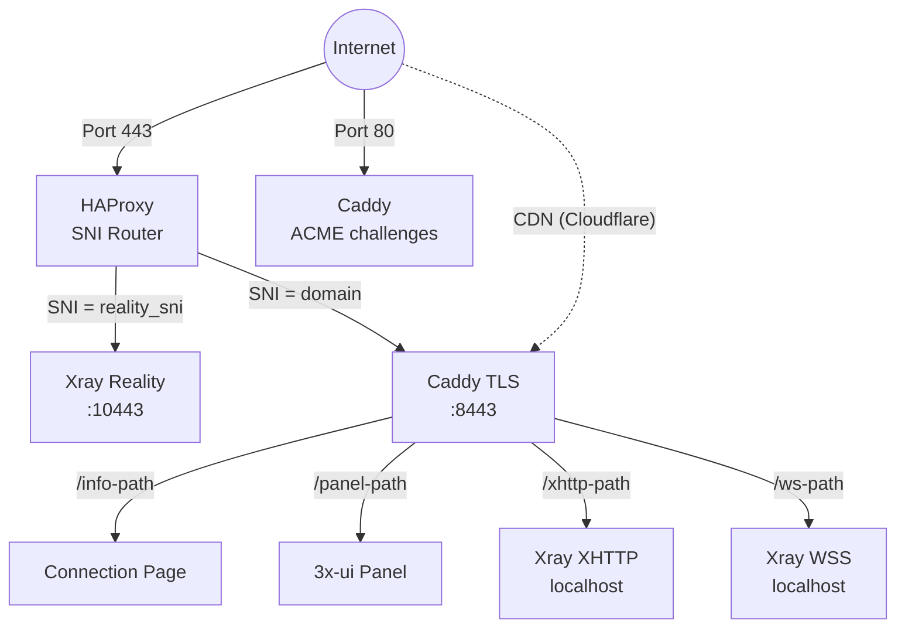

## Топология сервисов

### Автономный режим (без домена)

HAProxy **не** завершает TLS. Он читает имя хоста SNI из TLS Client Hello и пересылает необработанный TCP-поток на соответствующий бэкенд.

Caddy запрашивает сертификат Let's Encrypt IP через профиль ACME `shortlived` (6-дневное действие, автоматическое обновление). При невозможности выпуска сертификата IP использует самоподписанный сертификат.

XHTTP работает на порту localhost и обратно проксируется Caddy — дополнительного внешнего порта не требуется.

### Режим домена

Режим домена добавляет VLESS+WSS как резервный путь CDN. Трафик проходит через CDN Cloudflare через WebSocket, что позволяет соединению работать даже если IP-адрес сервера заблокирован.

### Топология ретранслятора

Ретранслятор позволяет клиентам подключаться к внутреннему IP-адресу в своей стране, который затем пересылает трафик на выходной сервер за границей. Весь трафик между клиентом и выходом шифруется — ретранслятор видит только необработанный TCP и не может расшифровать содержимое. Все протоколы (Reality, XHTTP, WSS) работают прозрачно через ретранслятор.

## Как работает протокол Reality

1. Сервер генерирует **пару ключей x25519**. Открытый ключ используется с клиентами, приватный ключ остаётся на сервере.
2. Клиент подключается к порту 443 с TLS Client Hello содержащим домен маскировки (например, `www.microsoft.com`) в качестве SNI.
3. Для любого наблюдателя это выглядит как обычное HTTPS-соединение с microsoft.com.
4. Если **проверяющий** отправит свой собственный Client Hello, сервер проксирует соединение на реальный microsoft.com — проверяющий видит действительный сертификат.
5. Если клиент включает действительную аутентификацию (полученную из ключа x25519), сервер устанавливает VLESS-туннель.
6. **uTLS** делает Client Hello идентичным Chrome в каждом байте, преодолевая TLS fingerprinting.

## Назначение портов

| Порт | Сервис | Режим |
|------|--------|-------|
| 443 | HAProxy (SNI router) | Все |
| 80 | Caddy (ACME challenges) | Все |
| 10443 | Xray Reality (внутренний) | Все |
| 8443 | Caddy TLS (внутренний) | Все |
| localhost | Xray XHTTP | Когда XHTTP включён |
| localhost | Xray WSS | Режим домена |
| 2053 | 3x-ui panel (внутренний) | Все |

Порты XHTTP и WSS видны только на localhost — Caddy обратно проксирует их на порт 443.

## Конвейер подготовки

| № | Шаг | Назначение |
|---|-----|-----------|
| 1 | InstallPackages | Пакеты ОС |
| 2 | EnableAutoUpgrades | Автоматические обновления |
| 3 | SetTimezone | UTC |
| 4 | HardenSSH | Аутентификация только по ключу |
| 5 | ConfigureBBR | TCP congestion control |
| 6 | ConfigureFirewall | UFW: 22 + 80 + 443 |
| 7 | InstallDocker | Docker CE |
| 8 | Deploy3xui | 3x-ui контейнер |
| 9 | ConfigurePanel | Учётные данные панели |
| 10 | LoginToPanel | API аутентификация |
| 11 | CreateRealityInbound | VLESS+Reality |
| 12 | CreateXHTTPInbound | VLESS+XHTTP |
| 13 | CreateWSSInbound | VLESS+WSS (домен) |
| 14 | VerifyXray | Проверка здоровья |
| 15 | InstallHAProxy | SNI маршрутизация |
| 16 | InstallCaddy | TLS + reverse proxy |
| 17 | DeployConnectionPage | QR коды + страница |

## Жизненный цикл учётных данных

1. **Генерация**: случайные учётные данные (пароль панели, ключи x25519, UUID клиента)
2. **Сохранение локально**: `~/.meridian/credentials/<IP>/proxy.yml` — сохраняется ДО применения к серверу
3. **Применение**: пароль панели изменён, входящие точки созданы
4. **Синхронизация**: учётные данные скопированы в `/etc/meridian/proxy.yml` на сервере
5. **Повторные запуски**: загружены из кэша, не регенерированы (идемпотентно)
6. **На разных машинах**: загружены с сервера через SSH
7. **Удаление**: удалены как с сервера, так и с локальной машины
