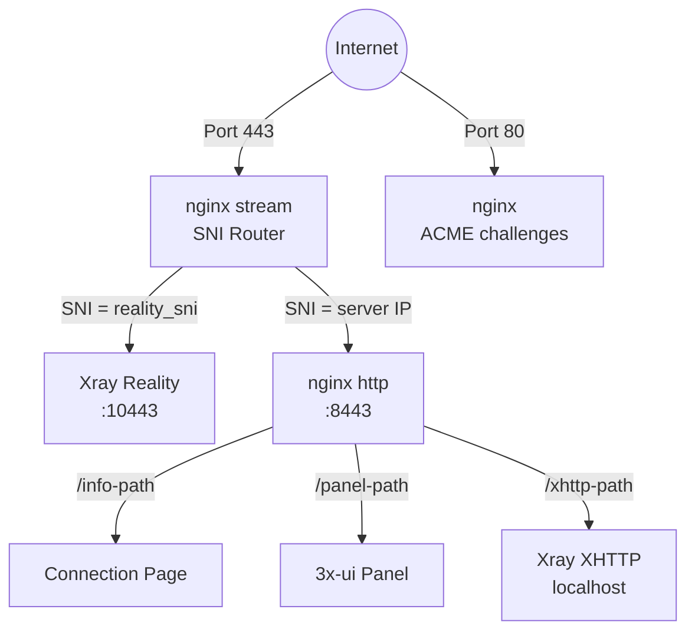
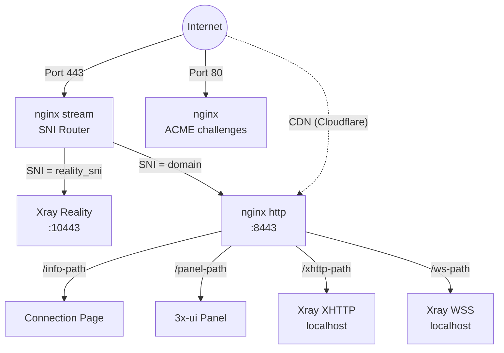
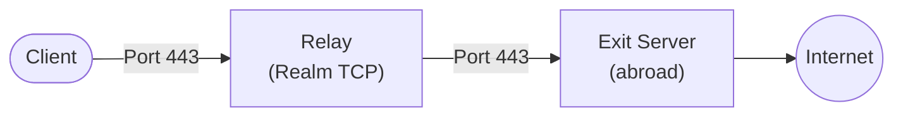

## Стек технологий

- **VLESS+Reality** (Xray-core) — прокси-протокол, который маскируется под легитимный TLS-сайт. Цензоры, проверяющие сервер, видят реальный сертификат (например, от microsoft.com). Подключиться могут только клиенты с правильным приватным ключом.
- **3x-ui** — веб-панель для управления Xray, развёрнутая как Docker-контейнер. Meridian управляет ею полностью через REST API.
- **nginx** — единый процесс веб-сервера, обрабатывающий как SNI-маршрутизацию, так и TLS. Модуль stream слушает порт 443 и маршрутизирует трафик по SNI-имени хоста без завершения TLS. Модуль http на порту 8443 завершает TLS, обслуживает страницы подключения, обратно проксирует панель и трафик XHTTP/WSS к Xray. Сертификаты управляются acme.sh (сертификат Let's Encrypt IP через профиль ACME `shortlived` в автономном режиме, сертификат домена в режиме домена).
- **Docker** — запускает 3x-ui (который содержит Xray). Весь прокси-трафик проходит через контейнер.
- **Чистый Python provisioner** — `src/meridian/provision/` выполняет шаги развёртывания через SSH. Каждый шаг получает `(conn, ctx)` и возвращает `StepResult`.
- **uTLS** — имитирует отпечаток TLS Client Hello Chrome, делая соединения неотличимыми от реального браузерного трафика.

## Топология сервисов

### Автономный режим (без домена)



nginx stream **не** завершает TLS. Он читает имя хоста SNI из TLS Client Hello и пересылает необработанный TCP-поток на соответствующий бэкенд.

acme.sh запрашивает сертификат Let's Encrypt IP через профиль ACME `shortlived` (6-дневное действие, автоматическое обновление). При невозможности выпуска сертификата IP использует самоподписанный сертификат.

XHTTP работает на порту localhost и обратно проксируется nginx — дополнительного внешнего порта не требуется.

### Режим домена



Режим домена добавляет VLESS+WSS как резервный путь CDN. Трафик проходит через CDN Cloudflare через WebSocket, что позволяет соединению работать даже если IP-адрес сервера заблокирован.

### Топология ретранслятора



Ретранслятор позволяет клиентам подключаться к внутреннему IP-адресу в своей стране, который затем пересылает трафик на выходной сервер за границей. Весь трафик между клиентом и выходом шифруется — ретранслятор видит только необработанный TCP и не может расшифровать содержимое. Все протоколы (Reality, XHTTP, WSS) работают прозрачно через ретранслятор.

## Как работает протокол Reality

1. Сервер генерирует **пару ключей x25519**. Открытый ключ используется с клиентами, приватный ключ остаётся на сервере.
2. Клиент подключается к порту 443 с TLS Client Hello содержащим домен маскировки (например, `www.microsoft.com`) в качестве SNI.
3. Для любого наблюдателя это выглядит как обычное HTTPS-соединение с microsoft.com.
4. Если **проверяющий** отправит свой собственный Client Hello, сервер проксирует соединение на реальный microsoft.com — проверяющий видит действительный сертификат.
5. Если клиент включает действительную аутентификацию (полученную из ключа x25519), сервер устанавливает VLESS-туннель.
6. **uTLS** делает Client Hello идентичным Chrome в каждом байте, преодолевая TLS fingerprinting.

## Структура Docker-контейнера

Docker-контейнер `3x-ui` содержит:
- **Веб-панель 3x-ui** — REST API на порту 2053 (внутренний)
- **Бинарник Xray** в `/app/bin/xray-linux-*` (путь зависит от архитектуры)
- **База данных** в `/etc/x-ui/x-ui.db` (SQLite, хранит конфигурации входящих и клиентов)
- **Конфигурация Xray** управляется 3x-ui (не статический файл)

Meridian управляет 3x-ui полностью через REST API:
- `POST /login` — аутентификация (form-urlencoded, возвращает session cookie)
- `POST /panel/api/inbounds/add` — создание VLESS inbound
- `GET /panel/api/inbounds/list` — список inbounds (проверка перед созданием)
- `POST /panel/setting/update` — настройка параметров панели
- `POST /panel/setting/updateUser` — смена учётных данных панели

## Панель управления (3x-ui)

Meridian использует [3x-ui](https://github.com/MHSanaei/3x-ui) как веб-панель управления Xray. CLI автоматизирует всё, но вы также можете получить прямой доступ к веб-панели для мониторинга и расширенной настройки.

### Как получить доступ

Панель доступна через nginx по случайному секретному HTTPS-пути — SSH-туннель не нужен. URL и учётные данные хранятся в локальном файле:

```
cat ~/.meridian/credentials/<IP>/proxy.yml
```

Найдите секцию `panel`:

```yaml
panel:
  username: a1b2c3d4e5f6
  password: Xk9mP2qR7vW4nL8jF3hT6yBs
  web_base_path: n7kx2m9qp4wj8vh3rf6tby5e
  port: 2053
```

URL панели:

```
https://<ip-вашего-сервера>/n7kx2m9qp4wj8vh3rf6tby5e/
```

### Возможности

- **Мониторинг трафика** — статистика загрузки/выгрузки по клиентам
- **Просмотр inbounds** — все настроенные протоколы VLESS (Reality, XHTTP, WSS)
- **Статус Xray** — проверка работоспособности прокси-движка
- **Расширенная настройка** — прямое изменение параметров Xray (для опытных пользователей)

### Важно

- `web_base_path` — случайная строка, это защита вашей панели. Не передавайте её посторонним.
- Все команды `meridian` CLI используют тот же API панели.
- Если вы измените настройки в панели напрямую, они могут быть перезаписаны при следующем `meridian deploy`.

## Конфигурация nginx

Meridian записывает в `/etc/nginx/conf.d/meridian-stream.conf` и `/etc/nginx/conf.d/meridian-http.conf` (никогда в основной nginx.conf). Это позволяет Meridian сосуществовать с собственной конфигурацией пользователя.

nginx обрабатывает:
- SNI-маршрутизацию на порту 443 (модуль stream, без завершения TLS)
- Завершение TLS на порту 8443 (модуль http, сертификаты управляются acme.sh)
- Обратный прокси для панели 3x-ui (на случайном пути)
- Обслуживание страниц подключения (размещённые страницы с URL для обмена)
- Обратный прокси для XHTTP-трафика к Xray (маршрутизация по пути, во всех режимах когда XHTTP включён)
- Обратный прокси для WSS-трафика к Xray (только режим домена)

## Назначение портов

| Порт | Сервис | Режим |
|------|--------|-------|
| 443 | nginx stream (SNI router) | Все |
| 80 | nginx (ACME challenges) | Все |
| 10443 | Xray Reality (внутренний) | Все |
| 8443 | nginx http (внутренний) | Все |
| localhost | Xray XHTTP | Когда XHTTP включён |
| localhost | Xray WSS | Режим домена |
| 2053 | 3x-ui panel (внутренний) | Все |

Порты XHTTP и WSS видны только на localhost — nginx обратно проксирует их на порт 443.

## Конвейер подготовки

Шаги выполняются последовательно через `build_setup_steps()`. Каждый шаг получает `(conn, ctx)` и возвращает `StepResult`.

| № | Шаг | Модуль | Назначение |
|---|-----|--------|-----------|
| 1 | InstallPackages | `common.py` | Пакеты ОС |
| 2 | EnableAutoUpgrades | `common.py` | Автоматические обновления |
| 3 | SetTimezone | `common.py` | UTC |
| 4 | HardenSSH | `common.py` | Аутентификация только по ключу |
| 5 | ConfigureBBR | `common.py` | TCP congestion control |
| 6 | ConfigureFirewall | `common.py` | UFW: 22 + 80 + 443 |
| 7 | InstallDocker | `docker.py` | Docker CE |
| 8 | Deploy3xui | `docker.py` | 3x-ui контейнер |
| 9 | ConfigurePanel | `panel.py` | Учётные данные панели |
| 10 | LoginToPanel | `panel.py` | API аутентификация |
| 11 | CreateRealityInbound | `xray.py` | VLESS+Reality |
| 12 | CreateXHTTPInbound | `xray.py` | VLESS+XHTTP |
| 13 | CreateWSSInbound | `xray.py` | VLESS+WSS (домен) |
| 14 | VerifyXray | `xray.py` | Проверка здоровья |
| 15 | InstallNginx | `services.py` | SNI маршрутизация + TLS + reverse proxy |
| 16 | DeployConnectionPage | `services.py` | QR коды + страница |

## Жизненный цикл учётных данных

1. **Генерация**: случайные учётные данные (пароль панели, ключи x25519, UUID клиента)
2. **Сохранение локально**: `~/.meridian/credentials/<IP>/proxy.yml` — сохраняется ДО применения к серверу
3. **Применение**: пароль панели изменён, входящие точки созданы
4. **Синхронизация**: учётные данные скопированы в `/etc/meridian/proxy.yml` на сервере
5. **Повторные запуски**: загружены из кэша, не регенерированы (идемпотентно)
6. **На разных машинах**: загружены с сервера через SSH
7. **Удаление**: удалены как с сервера, так и с локальной машины

## Расположение файлов

### На сервере
- `/etc/meridian/proxy.yml` — учётные данные и список клиентов
- `/etc/nginx/conf.d/meridian-stream.conf` — конфигурация nginx stream (SNI маршрутизация)
- `/etc/nginx/conf.d/meridian-http.conf` — конфигурация nginx http (TLS, reverse proxy)
- `/etc/ssl/meridian/` — TLS сертификаты (управляются acme.sh)
- Docker-контейнер `3x-ui` — Xray + панель

### На локальной машине
- `~/.meridian/credentials/<IP>/` — кэшированные учётные данные для каждого сервера
- `~/.meridian/servers` — реестр серверов
- `~/.meridian/cache/` — кэш проверки обновлений
- `~/.local/bin/meridian` — точка входа CLI (установлено через uv/pipx)
